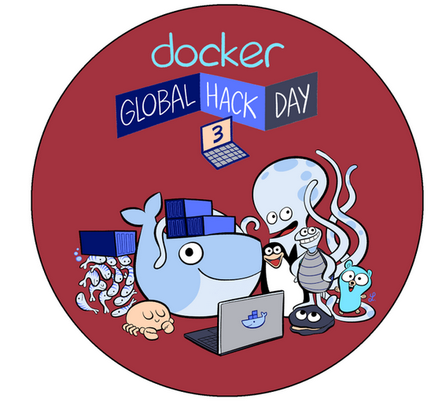

[](https://twitter.com/intent/tweet?url=&text=Don't%20change%20anything%20in%20your%20Docker%20container%20image%20and%20minify%20it%20by%20up%20to%2030x%20making%20it%20secure%20too!&url=http%3A%2F%2Fdockersl.im&hashtags=docker,small,secure)

# Minify and Secure Docker containers (free and open source!)

Don't change anything in your Docker container image and minify it by up to 30x making it secure too!

Keep doing what you are doing. No need to change anything. Use the base image you want. Use the package manager you want. Don't worry about hand optimizing your Dockerfile. You shouldn't have to throw away your tools and your workflow to have small container images.

Don't worry about manually creating Seccomp and AppArmor security profiles. You shouldn't have to become an expert in Linux syscalls, Seccomp and AppArmor to have secure containers. Even if you do know enough about it wasting time reverse engineering your application behavior can be time consuming.

docker-slim will optimize and secure your containers by understanding your application and what it needs using various analysis techniques. It will throw away what you don't need reducing the attack surface for your container. What if you need some of those extra things to debug your container? You can use dedicated debugging side-car containers for that (more details below).

docker-slim has been used with Node.js, Python, Ruby, Java, Golang, Elixir and PHP running on Ubuntu, Debian and Alpine Linux.

[](https://asciinema.org/a/czxJahFcUHWCGKVWzT7LDpVdE)

## Minification Examples

Node.js application images:

* from ubuntu:14.04  - 432MB  => 14MB   (minified by **30.85X**)
* from debian:jessie - 406MB  => 25.1MB (minified by **16.21X**)
* from node:alpine   - 66.7MB => 34.7MB (minified by **1.92X**)

Python application images:

* from ubuntu:14.04      - 438MB  => 16.8MB (minified by **25.99X**)
* from python:2.7-alpine - 84.3MB => 23.1MB (minified by **3.65X**)
* from python:2.7.15     - 916MB => 27.5MB  (minified by **33.29X**)

Ruby application images:

* from ubuntu:14.04 - 433MB => 13.8MB (minified by **31.31X**)

Golang application images:

* from golang:latest - 700MB => 1.56MB (minified by **448.76X**)
* from ubuntu:14.04  - 531MB => 1.87MB (minified by **284.10X**)
* from golang:alpine - 258MB => 1.56MB (minified by **165.61X**)
* from centos:7      - 615MB => 1.87MB (minified by **329.14X**)

JAVA application images:

* from ubuntu:14.04 - 743.6 MB => 100.3 MB

PHP application images:

* from php:7.0-cli - 368MB => 26.6MB (minified by **13.85X**)

Elixir application images:

* (Phoenix service) from elixir:1.6 - 1.1 GB => 37 MB (minified by **29.25X**)


---

<!-- START doctoc generated TOC please keep comment here to allow auto update -->
<!-- DON'T EDIT THIS SECTION, INSTEAD RE-RUN doctoc TO UPDATE -->
**Table of Contents**  *generated with [DocToc](https://github.com/thlorenz/doctoc)*

- [docker-slim: Lean and Mean Docker containers](#docker-slim-lean-and-mean-docker-containers)
  - [RECENT UPDATES](#new)
  - [INSTALLATION](#installation)
  - [BASIC USAGE INFO](#basic-usage-info)
  - [QUICK SECCOMP EXAMPLE](#quick-seccomp-example)
  - [USING AUTO-GENERATED SECCOMP PROFILES](#using-auto-generated-seccomp-profiles)
  - [ORIGINAL DEMO VIDEO](#original-demo-video)
  - [DEMO STEPS](#demo-steps)
  - [USAGE DETAILS](#usage-details)
  - [DOCKER CONNECT OPTIONS](#docker-connect-options)
  - [HTTP PROBE COMMANDS](#http-probe-commands)
  - [DEBUGGING MINIFIED CONTAINERS](#debugging-minified-containers)
  - [MINIFYING COMMAND LINE TOOLS](#minifying-command-line-tools)
  - [CURRENT STATE](#current-state)
  - [FAQ](#faq)
    - [Is it safe for production use?](#is-it-safe-for-production-use)
    - [How can I contribute if I don't know Go?](#how-can-i-contribute-if-i-dont-know-go)
    - [What's the best application for DockerSlim?](#whats-the-best-application-for-dockerslim)
    - [Can I use DockerSlim with dockerized command line tools?](#can-i-use-dockerslim-with-dockerized-command-line-tools)
    - [How can I get around the current USER command limitation?](#how-can-i-get-around-the-current-user-command-limitation)
  - [BUILD PROCESS](#build-process)
      - [Local Build Steps](#local-build-steps)
      - [Traditional Go Way to Build](#traditional-go-way-to-build)
      - [Builder Image Steps](#builder-image-steps)
  - [DESIGN](#design)
    - [CORE CONCEPTS](#core-concepts)
    - [DYNAMIC ANALYSIS OPTIONS](#dynamic-analysis-options)
    - [SECURITY](#security)
    - [CHALLENGES](#challenges)
  - [DEVELOPMENT PROGRESS](#development-progress)
    - [PHASE 3 (WIP)](#phase-3-wip)
    - [TODO](#todo)
  - [ORIGINS](#origins)
  - [ONLINE](#online)
  - [MINIFIED DOCKER HUB IMAGES](#minified-docker-hub-images)
  - [NOTES](#notes)

<!-- END doctoc generated TOC please keep comment here to allow auto update -->

## RECENT UPDATES

Latest version: 1.21 (8/25/2018)

* Better support for applications with dynamic libraries (e.g., python compiled with `--enable-shared`) (NEW)
* Additional network related Docker parameters (NEW)
* New sample apps (UPDATES)
* Extended version information (UPDATES)
* Alpine image support
* Ability to override ENV variables analyzing target image
* Docker 1.12 support
* User selected location to store DockerSlim state (global `--state-path` parameter).
* Auto-generated seccomp profiles for Docker 1.10.
* Python 3 support
* Docker connect options
* HTTP probe commands
* Include extra directories and files in minified images

## INSTALLATION

1. Download the zip package for your platform.
   - [Latest Mac binaries](https://github.com/docker-slim/docker-slim/releases/download/1.21/dist_mac.zip)
   - [Latest Linux binaries](https://github.com/docker-slim/docker-slim/releases/download/1.21/dist_linux.tar.gz)
2. Unzip the package.
3. Add the location where you unzipped the package to your PATH environment variable (optional).

If the directory where you extracted the binaries is not in your PATH then you'll need to run your `docker-slim` commands from that directory.

## BASIC USAGE INFO

`docker-slim [version|info|build|profile] [--http-probe|--remove-file-artifacts] <IMAGE_ID_OR_NAME>`

Example: `docker-slim build --http-probe my/sample-node-app`

To generate a Dockerfile for your "fat" image without creating a new "slim" image use the `info` command.

Example: `docker-slim info 6f74095b68c9`

## QUICK SECCOMP EXAMPLE

If you want to auto-generate a Seccomp profile AND minify your image use the `build` command. If you only want to auto-generate a Seccomp profile (along with other interesting image metadata) use the `profile` command.

Step one: run DockerSlim

`docker-slim build --http-probe your-name/your-app`

Step two: use the generated Seccomp profile

`docker run --security-opt seccomp:<docker-slim directory>/.images/<YOUR_APP_IMAGE_ID>/artifacts/your-name-your-app-seccomp.json <your other run params> your-name/your-app`

Feel free to copy the generated profile :-)

You can use the generated Seccomp profile with your original image or with the minified image.

## USING AUTO-GENERATED SECCOMP PROFILES

You can use the generated profile with your original image or with the minified image DockerSlim created:

`docker run -it --rm --security-opt seccomp:path_to/my-sample-node-app-seccomp.json -p 8000:8000 my/sample-node-app.slim`

## ORIGINAL DEMO VIDEO

[](https://www.youtube.com/watch?v=uKdHnfEbc-E)

[Demo video on YouTube](https://youtu.be/uKdHnfEbc-E)

## DEMO STEPS

The demo run on Mac OS X, but you can build a linux version. Note that these steps are different from the steps in the demo video.

1. Get the docker-slim [Mac](https://github.com/docker-slim/docker-slim/releases/download/1.21/dist_mac.zip) or [Linux](https://github.com/docker-slim/docker-slim/releases/download/1.21/dist_linux.tar.gz) binaries. Unzip them and optionally add their directory to your PATH environment variable if you want to use the app from other locations.

  The extracted directory contains two binaries:

  * `docker-slim` <- the main application
  * `docker-slim-sensor` <- the sensor application used to collect information from running containers

2. Clone this repo to use the sample apps. You can skip this step if you have your own app.

  `git clone https://github.com/docker-slim/docker-slim.git`

3. Create a Docker image for the sample node.js app in `examples/apps/node_ubuntu`. You can skip this step if you have your own app.

  `cd docker-slim/examples/apps/node_ubuntu`

  `eval "$(docker-machine env default)"` <- optional (depends on how Docker is installed on your machine); if the Docker host is not running you'll need to start it first: `docker-machine start default`; see the `Docker connect options` section for more details.

  `docker build -t my/sample-node-app .`

4. Run `docker-slim`:

  `./docker-slim build --http-probe my/sample-node-app` <- run it from the location where you extraced the docker-slim binaries (or update your PATH env var to include the `docker-slim` bin directory)

  DockerSlim creates a special container based on the target image you provided. It also creates a resource directory where it stores the information it discovers about your image: `<docker-slim directory>/.images/<TARGET_IMAGE_ID>`.

5. Use curl (or other tools) to call the sample app (optional)

  `curl http://<YOUR_DOCKER_HOST_IP>:<PORT>`

  This is an optional step to make sure the target app container is doing something. Depending on the application it's an optional step. For some applications it's required if it loads new application resources dynamically based on the requests it's processing.

  You can get the port number either from the `docker ps` or `docker port <CONTAINER_ID>` commands. The current version of DockerSlim doesn't allow you to map exposed network ports (it works like `docker run … -P`).

  If you set the `http-probe` flag then `docker-slim` will try to call your application using HTTP/HTTPS: `./docker-slim build --http-probe my/sample-node-app`

6. Press <enter> and wait until `docker-slim` says it's done

  If you set the `http-probe` flag and you press <enter> before the HTTP probe is done the probe might produce an EOF error because DockerSlim will shut down the target container before all probe commands are done executing. It's ok to ignore it unless you really need the probe to finish.

7. Once DockerSlim is done check that the new minified image is there

  `docker images`

  You should see `my/sample-node-app.slim` in the list of images. Right now all generated images have `.slim` at the end of its name.

8. Use the minified image

  `docker run -it --rm --name="slim_node_app" -p 8000:8000 my/sample-node-app.slim`

## USAGE DETAILS

`docker-slim [global options] command [command options] <Docker image ID or name>`

Commands:

* `build` - Collect fat image information and build a slim image from it
* `profile` - Collect fat image information and generate a fat container report
* `info` - Collect fat image information and reverse engineers its Dockerfile (no runtime container analysis)
* `version` - Show docker-slim and docker version information

Global options:

* `--version` - print the version
* `--debug` - enable debug logs
* `--verbose` - enable info logs
* `--log-level` - set the logging level ('debug', 'info', 'warn' (default), 'error', 'fatal', 'panic')
* `--log-format` - set the format used by logs ('text' (default), or 'json')
* `--log` - log file to store logs
* `--host` - Docker host address
* `--tls` - use TLS connecting to Docker
* `--tls-verify` - do TLS verification
* `--tls-cert-path` - path to TLS cert files
* `--state-path value` - DockerSlim state base path (must set it if the DockerSlim binaries are not in a writable directory!)

### `BUILD` COMMAND OPTIONS

* `--http-probe` - enables HTTP probing (disabled by default)
* `--http-probe-cmd` - additional HTTP probe command [zero or more]
* `--http-probe-cmd-file` - file with user defined HTTP probe commands
* `--show-clogs` - show container logs (from the container used to perform dynamic inspection)
* `--show-blogs` - show build logs (when the minified container is built)
* `--remove-file-artifacts` - remove file artifacts when command is done (note: you'll loose autogenerated Seccomp and Apparmor profiles)
* `--tag` - use a custom tag for the generated image (instead of the default: `<original_image_name>.slim`)
* `--entrypoint` - override ENTRYPOINT analyzing image
* `--cmd` - override CMD analyzing image
* `--mount` - mount volume analyzing image (the mount parameter format is identical to the `-v` mount command in Docker) [zero or more]
* `--include-path` - Include directory or file from image [zero or more]
* `--env` - override ENV analyzing image [zero or more]
* `--workdir` - override WORKDIR analyzing image
* `--network` - override default container network settings analyzing image
* `--expose` - use additional EXPOSE instructions analyzing image [zero or more]
* `--link` - add link to another container analyzing image [zero or more]
* `--hostname` - override default container hostname analyzing image
* `--etc-hosts-map` - add a host to IP mapping to /etc/hosts analyzing image [zero or more]
* `--container-dns` - add a dns server analyzing image [zero or more]
* `--container-dns-search` - add a dns search domain for unqualified hostnames analyzing image [zero or more]
* `--continue-after` - Select continue mode: enter | signal | probe | timeout or numberInSeconds (default: enter)

The `--include-path` option is useful if you want to customize your minified image adding extra files and directories. Future versions will also include the `--exclude-path` option to have even more control.

The `--continue-after` option is useful if you need to script `docker-slim`. If you pick the `probe` option then `docker-slim` will continue executing the build command after the HTTP probe is done executing. If you pick the `timeout` option `docker-slim` will allow the target container to run for 60 seconds before it will attempt to collect the artifacts. You can specify a custom timeout value by passing a number of seconds you need instead of the `timeout` string. If you pick the `signal` option you'll need to send a USR1 signal to the `docker-slim` process.

## DOCKER CONNECT OPTIONS

If you don't specify any Docker connect options `docker-slim` expects to find the following environment variables: `DOCKER_HOST`, `DOCKER_TLS_VERIFY` (optional), `DOCKER_CERT_PATH` (required if `DOCKER_TLS_VERIFY` is set to `"1"`)

On Mac OS X you get them when you run `eval "$(docker-machine env default)"` or when you use the Docker Quickstart Terminal.

If the Docker environment variables are configured to use TLS and to verify the Docker cert (default behavior), but you want to disable the TLS verification you can override the TLS verification behavior by setting the `--tls-verify` to false:

`docker-slim --tls-verify=false build --http-probe=true my/sample-node-app-multi`

You can override all Docker connection options using these flags: `--host`, `--tls`, `--tls-verify`, `--tls-cert-path`. These flags correspond to the standard Docker options (and the environment variables).

If you want to use TLS with verification:

`docker-slim --host=tcp://192.168.99.100:2376 --tls-cert-path=/Users/youruser/.docker/machine/machines/default --tls=true --tls-verify=true build --http-probe=true my/sample-node-app-multi`

If you want to use TLS without verification:

`docker-slim --host=tcp://192.168.99.100:2376 --tls-cert-path=/Users/youruser/.docker/machine/machines/default --tls=true --tls-verify=false build --http-probe=true my/sample-node-app-multi`

If the Docker environment variables are not set and if you don't specify any Docker connect options `docker-slim` will try to use the default unix socket.

## HTTP PROBE COMMANDS

If you enable the HTTP probe it will default to running `GET /` with HTTP and then HTTPS on every exposed port. You can add additional commands using these two options: `--http-probe-cmd` and `--http-probe-cmd-file`.

The `--http-probe-cmd` option is good when you want to specify a small number of simple commands where you select some or all of these HTTP command options: protocol, method (defaults to GET), resource (path and query string).

Here are a couple of examples:

Adds two extra probe commands: `GET /api/info` and `POST /submit` (tries http first, then tries https):
`docker-slim build --show-clogs --http-probe-cmd /api/info --http-probe-cmd POST:/submit my/sample-node-app-multi`

Adds one extra probe command: `POST /submit` (using only http):
`docker-slim build --show-clogs --http-probe-cmd http:POST:/submit my/sample-node-app-multi`

The `--http-probe-cmd-file` option is good when you have a lot of commands and/or you want to select additional HTTP command options.

Here's an example:

`docker-slim build --show-clogs --http-probe-cmd-file probeCmds.json my/sample-node-app-multi`

Commands in `probeCmds.json`:

```
{
  "commands":
  [
   {
     "resource": "/api/info"
   },
   {
     "method": "POST",
     "resource": "/submit"
   },
   {
     "procotol": "http",
     "resource": "/api/call?arg=one"
   },
   {
     "protocol": "http",
     "method": "POST",
     "resource": "/submit2",
     "body": "key=value"
   }
  ]
}
```

The HTTP probe command file path can be a relative path (relative to the current working directory) or it can be an absolute path.


## DEBUGGING MINIFIED CONTAINERS

You can create dedicated debugging side-car container images loaded with the tools you need for debugging target containers. This allows you to keep your production container images small. The debugging side-car containers attach to the running target containers.

Assuming you have a running container named `node_app_alpine` you can attach your debugging side-car with a command like this: `docker run --rm -it --pid=container:node_app_alpine --net=container:node_app_alpine --cap-add sys_admin alpine sh`. In this example, the debugging side-car is a regular alphine image. This is exactly what happens with the `node_alpine` app sample (located in the `/examples/apps/node_alpine` directory) and the `run_debug_sidecar.command` helper script.

If you run the `ps` command in the side-car you'll see the application from the target container:
```
# ps
PID   USER     TIME   COMMAND
    1 root       0:00 node /opt/my/service/server.js
   13 root       0:00 sh
   38 root       0:00 ps
```

You can access the target container file system through `/proc/<TARGET_PID>/root`:
```
# ls -lh /proc/1/root/opt/my/service
total 8
drwxr-xr-x    3 root     root        4.0K Sep  2 15:51 node_modules
-rwxr-xr-x    1 root     root         415 Sep  8 00:52 server.js
```


## MINIFYING COMMAND LINE TOOLS

Unless the default CMD instruction in your Dockerfile is sufficient you'll have to specify command line parameters when you execute the `build` command in DockerSlim. This can be done with the `--cmd` option.

Other useful command line parameters:

* `--show-clogs` - use it if you want to see the output of your container.
* `--mount` - use it  to mount a volume when DockerSlim inspects your image.
* `--entrypoint` - use it if you want to override the ENTRYPOINT instruction when DockerSlim inspects your image.

Note that the `--entrypoint` and `--cmd` options don't override the `ENTRYPOINT` and `CMD` instructions in the final minified image.

Here's a sample `build` command:

`docker-slim build --show-clogs=true --cmd docker-compose.yml --mount $(pwd)/data/:/data/ dslim/container-transform`

It's used to minify the `container-transform` tool. You can get the minified image from [`Docker Hub`](https://hub.docker.com/r/dslim/container-transform.slim/).

## CURRENT STATE

It works pretty well with the sample Node.js, Python (2 and 3), Ruby, Java and Golang images (built from `examples/apps`). PHP support is WIP. There's already one PHP example, but more needs to be done to support Apache and Nginx based PHP apps. More testing needs to be done to see how it works with other images. Rails/unicorn app images are not fully supported yet (WIP).

You can also run `docker-slim` in the `info` mode and it'll generate useful image information including a "reverse engineered" Dockerfile.

DockerSlim now also generates Seccomp (usable) and AppArmor (WIP) profiles for your container.

Works with Docker 1.8 - 1.9, 1.10, 1.11, 1.12, 1.13, 17.03, 17.12.

Note:

You don't need Docker 1.10 or above to generate Seccomp profiles, but you do need it if you want to use the generated profiles.

## FAQ

### Is it safe for production use?

Yes! Either way, you should test your Docker images.

### How can I contribute if I don't know Go?

You don't need to read the language spec and lots of books :-) Go through the [Tour of Go](https://tour.golang.org/welcome/1) and optionally read [50 Shades of Go](http://devs.cloudimmunity.com/gotchas-and-common-mistakes-in-go-golang/) and you'll be ready to contribute!

### What's the best application for DockerSlim?

DockerSlim will work for any dockerized application; however, DockerSlim automates app interactions for applications with an HTTP API. You can use DockerSlim even if your app doesn't have an HTTP API. You'll need to interact with your application manually to make sure DockerSlim can observe your application behavior.

### Can I use DockerSlim with dockerized command line tools?

Yes. The --cmd, --entrypoint, and --mount options will help you minify your image. The `container-transform` tool is a good example.

Notes:

You can explore the artifacts DockerSlim generates when it's creating a slim image. You'll find those in `<docker-slim directory>/.images/<TARGET_IMAGE_ID>/artifacts`. One of the artifacts is a "reverse engineered" Dockerfile for the original image. It'll be called `Dockerfile.fat`.

If you'd like to see the artifacts without running `docker-slim` you can take a look at the `examples/artifacts` directory in this repo. It doesn't include any image files, but you'll find:

* a reverse engineered Dockerfile (`Dockerfile.fat`)
* a container report file (`creport.json`)
* a sample AppArmor profile (which will be named based on your original image name)
*   and a sample Seccomp profile

If you don't want to create a minified image and only want to "reverse engineer" the Dockerfile you can use the `info` command.

### How can I get around the current USER command limitation?

If you have a non-root user declared in your Dockerfile you'll need to use this workaround to make sure DockerSlim can minify your image:

Don't add an explicit USER statement in your Dockerfile.

Explicitly include /etc/passwd when you minify your image with DockerSlim (using the --include-path docker-slim parameter).

Example: docker-slim --debug build --http-probe --include-path /etc/passwd your-docker-image-name

Use an explicit -u parameter in docker run.
Example: docker run -d -u "your-user-name" -p 8000:8000 your-minified-docker-image-name

Note that you should be able to avoid including /etc/passwd if you are ok with using UIDs instead of text user name in the -u parameter to docker run.

## BUILD PROCESS

Go 1.8 or higher is recommended. You can use earlier version of Go, but it can't be lower than Go 1.5.1. Versions prior to 1.5.1 have a Docker/ptrace related bug (Go kills processes if your app is PID 1). When the 'monitor' is separate from the 'launcher' process it will be possible to user older Go versions again.

Before you build `docker-slim` you need to install `gox`. Additional tools to install:`golint` and `govendor`) (optional; you'll need it only if you have problems pulling the dependencies with vanilla `go get`)

Tools:

* `gox` - Must install it if you want to use the build scripts (not required if you want to do native builds). See `https://github.com/mitchellh/gox` for more details.
* `govendor` - Should install if you intend to add/change dependencies (you can still manage dependencies manually if want). See `https://github.com/kardianos/govendor` for more details.
* `golint` - Optional tool for code analysis.  See `https://github.com/golang/lint` for more details.

You can install these tools using the `tools.get.sh` shell script in the `scripts` directory.

Notes:

* Make sure you have `golint` if you intend to run the `src.inspect.sh` or `mac.src.inspect.command` scripts. Install it with `go get -u github.com/golang/lint/golint` if you don't have it.

#### Local Build Steps

Once you install the dependencies (GOX - required; Godep - optional) run these scripts:

1. Prepare the code (do it once after you download the code): `./scripts/src.prep.sh`
2. Build it: `./scripts/src.build.sh`

You can use the clickable `.command` scripts on Mac OS X (located in the `scripts` directory):

1. `mac.src.prep.command`
2. `mac.src.build.command`

Notes:

These helper scripts make it possible to build the code anywhere on the system. It doesn't have to be in the `$GOPATH/src` directory.

#### Traditional Go Way to Build

If you don't want to use the helper scripts you can build `docker-slim` using regular go commands:

1. `cd $GOPATH`
2. `mkdir -p src/github.com/docker-slim`
3. `cd $GOPATH/src/github.com/docker-slim`
4. `git clone https://github.com/docker-slim/docker-slim.git` <- if you decide to use `go get` to pull the `docker-slim` repo make sure to use the `-d` flag, so Go doesn't try to build it
5. `cd docker-slim`
6. `go build -v ./apps/docker-slim` <- builds the main app in the repo's root directory
7. `env GOOS=linux GOARCH=amd64 go build -v ./apps/docker-slim-sensor` <- builds the sensor app (must be built as a linux executable)

#### Builder Image Steps

You can also build `docker-slim` using a "builder" Docker image. The helper scripts are located in the `scripts` directory.

1. Create the "builder" image: `./docker-slim-builder.build.sh` (or click on `docker-slim-builder.build.command` if you are using Mac OS X)
2. Build the tool: `docker-slim-builder.run.sh` (or click on `docker-slim-builder.run.command` if you are using Mac OS X)

## DESIGN

### CORE CONCEPTS

1. Inspect container metadata (static analysis)
2. Inspect container data (static analysis)
3. Inspect running application (dynamic analysis)
4. Build an application artifact graph
5. Use the collected application data to build small images
6. Use the collected application data to auto-generate various security framework configurations.

### DYNAMIC ANALYSIS OPTIONS

1. Instrument the container image (and replace the entrypoint/cmd) to collect application activity data
2. Use kernel-level tools that provide visibility into running containers (without instrumenting the containers)
3. Disable relevant namespaces in the target container to gain container visibility (can be done with runC)

### SECURITY

The goal is to auto-generate Seccomp, AppArmor, (and potentially SELinux) profiles based on the collected information.

* AppArmor profiles
* Seccomp profiles

### CHALLENGES

Some of the advanced analysis options require a number of Linux kernel features that are not always included. The kernel you get with Docker Machine / Boot2docker is a great example of that.


## DEVELOPMENT PROGRESS

### PHASE 3 (WIP)

* Auto-generate AppArmor profiles (almost usable :-))
* Option to pause builder execution to allow manual changes to the minified image artifacts.
* Support additional command line parameters to specify CMD, VOLUME, ENV info.
* Better support for command line applications

### TODO

* Discover HTTP endpoints to make the HTTP probe more intelligent.
* Scripting language dependency discovery in the "scanner" app.
* Explore additional dependency discovery methods.
* Build/use a custom Boot2docker kernel with every required feature turned on.
* "Live" image create mode - to create new images from containers where users install their applications interactively.

## ORIGINS

DockerSlim was a [Docker Global Hack Day \#dockerhackday](https://www.docker.com/community/hackathon) project. It barely worked at the time :-)



Since then it's been improved and it works pretty well for its core use cases. It can be better though. That's why the project needs your help! You don't need to know much about Docker and you don't need to know anything about Go. You can contribute in many different ways. For example, use DockerSlim on your images and open a Github issue documenting your experience even if it worked just fine :-)

## ONLINE

IRC (freenode): \#dockerslim

Docker Hub: [dslim](https://hub.docker.com/r/dslim/) (dockerslim is already taken :-()

## MINIFIED DOCKER HUB IMAGES

* [`container-transform`](https://hub.docker.com/r/dslim/container-transform.slim/)

## CONTRIBUTING

If the project sounds interesting or if you found a bug see [`CONTRIBUTING.md`](https://github.com/docker-slim/docker-slim/blob/master/CONTRIBUTING.md) and submit a PR!

## LICENSE

Apache License v2, see [LICENSE](https://github.com/docker-slim/docker-slim/blob/master/LICENSE) for details.

---

[](https://goreportcard.com/report/github.com/docker-slim/docker-slim)
