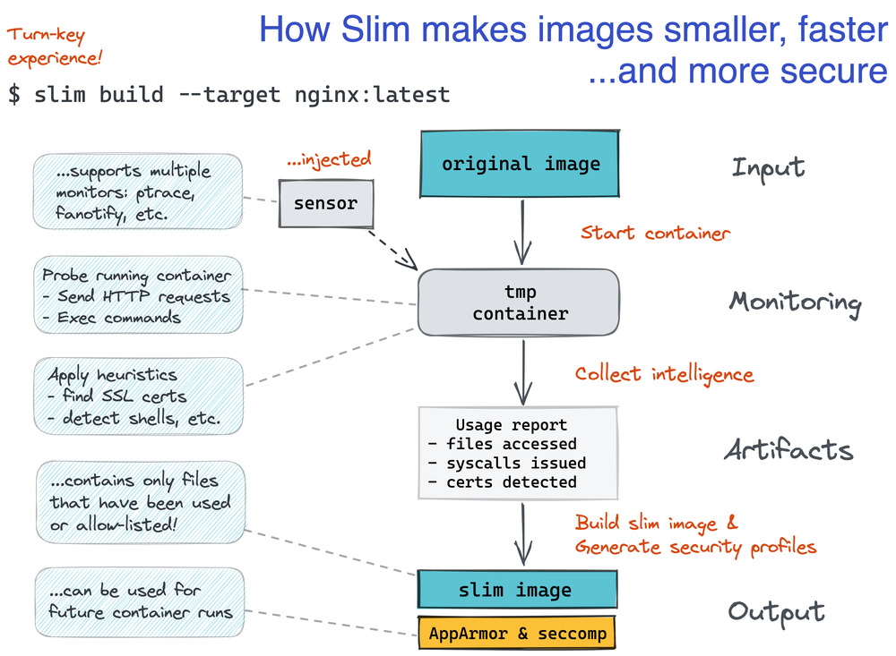

[](https://gitter.im/docker-slim/community)
[](https://discord.gg/9tDyxYS)
[](https://twitter.com/DockerSlim)
[](https://www.youtube.com/channel/UCy7RHjJlaBhpCCbChrd8POA?sub_confirmation=1)

[](https://gitpod.io/#https://github.com/slimtoolkit/slim)

[](https://github.com/slimtoolkit/slim#installation)
[](https://github.com/slimtoolkit/examples)

[](https://portal.slim.dev/login?invitecode=invite.1s85zlfnYX0p5TT1XKja49pAHbL)


# Optimize Your Experience with Containers. Make Your Containers Better, Smaller, More Secure and Do Less to Get There (free and open source!)

Note that **DockerSlim** is now just **Slim** (**SlimToolkit** is the full name, so it's easier to find it online) to show its growing support for additional container tools and runtimes in the cloud native ecosystem.

**Slim** is now a CNCF Sandbox project. It was created by [Kyle](https://github.com/kcq) [Quest](https://twitter.com/kcqon) and it's been improved by many [contributors](https://github.com/slimtoolkit/slim/graphs/contributors). The project is supported by [Slim.AI](https://slim.ai).

## Overview

Slim allows developers to inspect, optimize and debug their containers using its `xray`, `lint`, `build`, `debug`, `run`, `images`, `merge`, `registry`, `vulnerability` (and other) commands. It simplifies and improves your developer experience building, customizing and using containers. It makes your containers better, smaller and more secure while providing advanced visibility and improved usability working with the original and minified containers.

Don't change anything in your container image and minify it by up to 30x making it secure too! Optimizing images isn't the only thing it can do though. It can also help you understand and author better container images.

Keep doing what you are doing. No need to change anything. Use the base image you want. Use the package manager you want. Don't worry about hand optimizing your Dockerfile. You shouldn't have to throw away your tools and your workflow to have small container images.

Don't worry about manually creating Seccomp and AppArmor security profiles. You shouldn't have to become an expert in Linux syscalls, Seccomp and AppArmor to have secure containers. Even if you do know enough about it wasting time reverse engineering your application behavior can be time-consuming.

Slim will optimize and secure your containers by understanding your application and what it needs using various analysis techniques. It will throw away what you don't need, reducing the attack surface of your container. What if you need some of those extra things to debug your container? You can use dedicated debugging side-car containers for that (more details below).

Understand your container image before and after you optimize it using the `xray` command in the `slim` app or the [**Slim.AI SaaS**](https://portal.slim.dev/login?invitecode=invite.1s85zlfnYX0p5TT1XKja49pAHbL) where you can get even more powerful insights including how your container image changed.

Slim has been used with Node.js, Python, Ruby, Java, Go, Rust, Elixir and PHP (some app types) running on Ubuntu, Debian, CentOS, Alpine and even Distroless.

Note that some application stacks do require advanced container probing to make sure that all dynamically loaded components are detected. See the `--http-probe*` flags for more details to know how you can define custom probe commands. In some cases you might also need to use the `--include-path` flag to make sure everything your application needs is included (e.g., `ubuntu.com` python SPA app container image [example](https://github.com/slimtoolkit/examples/tree/master/3rdparty/ubuntu-com) where the client side template files are explicitly included).

It's also a good idea to use your app/environment tests when you run the Slim app. See the `--continue-after` flag for more details about integrating your tests with the temporary container Slim creates when it's doing its dynamic analysis. Running tests in the target container is also an option, but it does require you to specify a custom ENTRYPOINT/CMD with a custom wrapper to start your app and to execute your tests.



Interactive CLI prompt screencast:

[](https://asciinema.org/a/311513)

Watch this screencast to see how an application image is minified by more than 30x.

[](https://asciinema.org/a/rHqW8cbr3vXe0WxorHsD36n7V)

When you run the `build` or `profile` commands in Slim it gives you an opportunity to interact with the temporary container it creates. By default, it will pause and wait for your input before it continues its execution. You can change this behavior using the `--continue-after` flag.

If your application exposes any web interfaces (e.g., when you have a web server or an HTTP API), you'll see the port numbers on the host machine you will need to use to interact with your application (look for the `port.list` and `target.port.info` messages on the screen). For example, in the screencast above you'll see that the internal application port 8000 is mapped to port 32911 on your host.

Note that Slim will interact with your application for you when HTTP probing is enabled (enabled by default; see the `--http-probe*` flag docs for more details). Some web applications built with scripting languages like Python or Ruby require service interactions to load everything in the application. Enable HTTP probing unless it gets in your way.

You can also interact with the temporary container via a shell script or snippet using `--exec-file` or `--exec`. For example, you can create a container which is only capable of using curl.

```bash
>> docker pull archlinux:latest
...

>> slim build --target archlinux:latest --tag archlinux:curl --http-probe=false --exec "curl checkip.amazonaws.com"
...

>> docker run archlinux:curl curl checkip.amazonaws.com
...

>> docker images
archlinux                 curl                ...        ...         17.4MB
archlinux                 latest              ...        ...         467MB
...
```

## Community

Feel free to join any of these channels or just open a new [`Github issue`](https://github.com/slimtoolkit/slim/issues) if you want to chat or if you need help.

* [`CNCF Slack channel`](https://cloud-native.slack.com/archives/C059QP1RH1S)
* [`Discord server`](https://discord.gg/9tDyxYS)
* [`Discussions`](https://github.com/slimtoolkit/slim/discussions)
* [`Twitter`](https://twitter.com/SlimToolkit)

## Slim on the Internet

##### Books:
* [`Everyone's Docker/Kubernetes`](https://www.amazon.co.jp/dp/429710461X) (Japanese)
* [`Docker in Practice (2nd edition)`](https://www.amazon.com/Docker-Practice-Ian-Miell/dp/1617294802)
* [`Docker/Kubernetes Security Practice Guide`](https://www.amazon.co.jp/dp/4839970505) (Japanese)


## Minification Examples

You can find the examples in a separate repository: [https://github.com/slimtoolkit/examples](https://github.com/slimtoolkit/examples)

Node.js application images:

- from ubuntu:14.04 - 432MB => 14MB (minified by **30.85X**)
- from debian:jessie - 406MB => 25.1MB (minified by **16.21X**)
- from node:alpine - 66.7MB => 34.7MB (minified by **1.92X**)
- from node:distroless - 72.7MB => 39.7MB (minified by **1.83X**)

Python application images:

- from ubuntu:14.04 - 438MB => 16.8MB (minified by **25.99X**)
- from python:2.7-alpine - 84.3MB => 23.1MB (minified by **3.65X**)
- from python:2.7.15 - 916MB => 27.5MB (minified by **33.29X**)
- from centos:7 - 647MB => 23MB (minified by **28.57X**)
- from centos/python-27-centos7 - 700MB => 24MB (minified by **29.01X**)
- from python2.7:distroless - 60.7MB => 18.3MB (minified by **3.32X**)

Ruby application images:

- from ubuntu:14.04 - 433MB => 13.8MB (minified by **31.31X**)
- from ruby:2.2-alpine - 319MB => 27MB (minified by **11.88X**)
- from ruby:2.5.3 - 978MB => 30MB (minified by **32.74X**)

Go application images:

- from golang:latest - 700MB => 1.56MB (minified by **448.76X**)
- from ubuntu:14.04 - 531MB => 1.87MB (minified by **284.10X**)
- from golang:alpine - 258MB => 1.56MB (minified by **165.61X**)
- from centos:7 - 615MB => 1.87MB (minified by **329.14X**)

Rust application images:

- from rust:1.31 - 2GB => 14MB (minified by **147.16X**)

Java application images:

- from ubuntu:14.04 - 743.6 MB => 100.3 MB

PHP application images:

- from php:7.0-cli - 368MB => 26.6MB (minified by **13.85X**)

Haskell application images:

- (Scotty service) from haskell:8 - 2.09GB => 16.6MB (minified by **125.32X**)
- (Scotty service) from haskell:7 - 1.5GB => 21MB (minified by 71X)

Elixir application images:

- (Phoenix service) from elixir:1.6 - 1.1 GB => 37 MB (minified by **29.25X**)

---

<!-- START doctoc generated TOC please keep comment here to allow auto update -->
<!-- DON'T EDIT THIS SECTION, INSTEAD RE-RUN doctoc TO UPDATE -->

- [RECENT UPDATES](#recent-updates)
- [INSTALLATION](#installation)
- [BASIC USAGE INFO](#basic-usage-info)
- [COMMANDS](#commands)
- [USAGE DETAILS](#usage-details)
  - [`LINT` COMMAND OPTIONS](#lint-command-options)
  - [`XRAY` COMMAND OPTIONS](#xray-command-options)
  - [`BUILD` COMMAND OPTIONS](#build-command-options)
  - [`DEBUG` COMMAND OPTIONS](#debug-command-options)
  - [`RUN` COMMAND OPTIONS](#run-command-options)
  - [`REGISTRY` COMMAND OPTIONS](#registry-command-options)
  - [`VULNERABILITY` COMMAND OPTIONS](#vulnerability-command-options)
- [RUNNING CONTAINERIZED](#running-containerized)
- [DOCKER CONNECT OPTIONS](#docker-connect-options)
- [HTTP PROBE COMMANDS](#http-probe-commands)
- [DEBUGGING MINIFIED CONTAINERS](#debugging-minified-containers)
- [MINIFYING COMMAND LINE TOOLS](#minifying-command-line-tools)
- [QUICK SECCOMP EXAMPLE](#quick-seccomp-example)
- [USING AUTO-GENERATED SECCOMP PROFILES](#using-auto-generated-seccomp-profiles)
- [ORIGINAL DEMO VIDEO](#original-demo-video)
- [DEMO STEPS](#demo-steps)
- [FAQ](#faq)
  - [Is it safe for production use?](#is-it-safe-for-production-use)
  - [How can I contribute if I don't know Go?](#how-can-i-contribute-if-i-dont-know-go)
  - [What's the best application for Slim?](#whats-the-best-application-for-slim)
  - [Can I use Slim with dockerized command line tools?](#can-i-use-slim-with-dockerized-command-line-tools)
  - [What if my Docker images uses the USER command?](#what-if-my-docker-images-uses-the-user-command)
  - [Nginx fails in my minified image](#nginx-fails-in-my-minified-image)
  - [Slim fails with a 'no permission to read from' error](#slim-fails-with-a-no-permission-to-read-from-error)
- [BUILD PROCESS](#build-process)
  - [Build Steps](#build-steps)
- [CONTRIBUTING](#contributing)
- [DESIGN](#design)
  - [CORE CONCEPTS](#core-concepts)
  - [DYNAMIC ANALYSIS OPTIONS](#dynamic-analysis-options)
  - [SECURITY](#security)
  - [CHALLENGES](#challenges)
- [ORIGINS](#origins)
- [MINIFIED IMAGES ON DOCKER HUB](#minified-images-on-docker-hub)
- [LICENSE](#license)

<!-- END doctoc generated TOC please keep comment here to allow auto update -->

## RECENT UPDATES

Latest version: `1.40.11` (`2/2/2024`)

The 1.40.11 version adds support for the latest Docker Engine version, improves `xray` reports and adds new `build` command flags (`--include-dir-bins` and `--include-ssh-client`).

For more info about the latest release see the [`CHANGELOG`](CHANGELOG.md).


## INSTALLATION

If you already have Slim installed use the `update` command to get the latest version:

```
slim update
```

### Downloads

1. Download the zip package for your platform.

   - [Latest Mac binaries](https://github.com/slimtoolkit/slim/releases/download/1.40.11/dist_mac.zip) (`curl -L -o ds.zip https://github.com/slimtoolkit/slim/releases/download/1.40.11/dist_mac.zip`)

   - [Latest Mac M1 binaries](https://github.com/slimtoolkit/slim/releases/download/1.40.11/dist_mac_m1.zip) (`curl -L -o ds.zip https://github.com/slimtoolkit/slim/releases/download/1.40.11/dist_mac_m1.zip)`)

   - [Latest Linux binaries](https://github.com/slimtoolkit/slim/releases/download/1.40.11/dist_linux.tar.gz) (`curl -L -o ds.tar.gz https://github.com/slimtoolkit/slim/releases/download/1.40.11/dist_linux.tar.gz`)

   - [Latest Linux ARM binaries](https://github.com/slimtoolkit/slim/releases/download/1.40.11/dist_linux_arm.tar.gz) (`curl -L -o ds.tar.gz https://github.com/slimtoolkit/slim/releases/download/1.40.11/dist_linux_arm.tar.gz`)

   - [Latest Linux ARM64 binaries](https://github.com/slimtoolkit/slim/releases/download/1.40.11/dist_linux_arm64.tar.gz) (`curl -L -o ds.tar.gz https://github.com/slimtoolkit/slim/releases/download/1.40.11/dist_linux_arm64.tar.gz`)

2. Unzip the package and optionally move it to your bin directory.

Linux (for non-intel replace `dist_linux` with the platform-specific extracted path):
```
tar -xvf ds.tar.gz
mv  dist_linux/slim /usr/local/bin/
mv  dist_linux/slim-sensor /usr/local/bin/
```
Mac:
```
unzip ds.zip
mv  dist_mac/slim /usr/local/bin/
mv  dist_mac/slim-sensor /usr/local/bin/
```

3. Add the location where you unzipped the package to your PATH environment variable (optional).

If the directory where you extracted the binaries is not in your PATH then you'll need to run your Slim app binary from that directory.

#### Scripted Install

You can also use this script to install the current release of Slim on Linux (x86 and ARM) and macOS (x86 and Apple Silicon)

```bash
curl -sL https://raw.githubusercontent.com/slimtoolkit/slim/master/scripts/install-slim.sh | sudo -E bash -
```

### Homebrew

```
brew install docker-slim
```

The Homebrew installer: https://formulae.brew.sh/formula/docker-slim

### Docker

```
docker pull dslim/slim
```

See the [RUNNING CONTAINERIZED](#running-containerized) section for more usage info.

### SaaS

Powered by Slim. It will help you understand and troubleshoot your application containers and a lot more. If you use the `xray` command you'll want to try the SaaS. Understanding image changes is easy with its container diff capabilities. Connect your own registry and you can do the same with your own containers. Try it [here](https://portal.slim.dev/login?invitecode=invite.1s85zlfnYX0p5TT1XKja49pAHbL) without installing anything locally.


## BASIC USAGE INFO

`slim [global flags] [xray|build|profile|run|debug|lint|merge|images|registry|vulnerability|update|version|appbom|help] [command-specific flags] <IMAGE_ID_OR_NAME>`

If you don't specify any command `slim` will start in the interactive prompt mode.

### COMMANDS

- `xray` - Performs static analysis for the target container image (including 'reverse engineering' the Dockerfile for the image). Use this command if you want to know what's inside of your container image and what makes it fat.
- `lint` - Analyzes container instructions in Dockerfiles (Docker image support is WIP)
- `build` - Analyzes, profiles and optimizes your container image generating the supported security profiles. This is the most popular command.
- `debug` - Debug the running target container. This command is useful for troubleshooting running containers created from minimal/minified or regular container images.
- `registry` - Execute registry operations (`pull`, `push`, `copy`, `server`).
- `profile` - Performs basic container image analysis and dynamic container analysis, but it doesn't generate an optimized image.
- `run` - Runs one or more containers (for now runs a single container similar to `docker run`)
- `merge` - Merge two container images (optimized to merge minified images).
- `images` - Get information about container images (example: `slim --quiet images`).
- `vulnerability` - Execute vulnerability related tools and operations (`epss`).
- `version` - Shows the version information.
- `appbom` - Shows the application BOM (app composition/dependencies).
- `update` - Updates Slim to the latest version.
- `help` - Show the available commands and global flags

Example: `slim build my/sample-app`

See the `USAGE DETAILS` section for more details. Run `slim help` to get a high level overview of the available commands. Run `slim COMMAND_NAME` without any parameters and you'll get more information about that command (e.g., `slim build`).

If you run `slim` without any parameters you'll get an interactive prompt that will provide suggestions about the available commands and flags. `Tabs` are used to show the available options, to autocomplete the parameters and to navigate the option menu (which you can also do with Up and Down arrows). `Spaces` are used to move to the next parameter and `Enter` is used to run the command. For more info about the interactive prompt see [`go-prompt`](https://github.com/c-bata/go-prompt).

## USAGE DETAILS

`slim [global options] command [command options] <target image ID or name>`

Commands:

- `xray` - Show what's in the container image and reverse engineer its Dockerfile
- `lint` - Lint the target Dockerfile (or image, in the future)
- `build` - Analyze the target container image along with its application and build an optimized image from it
- `debug` - Debug the running target container. This command is useful for troubleshooting running containers created from minimal/minified or regular container images.
- `registry` - Execute registry operations (`pull`, `push`, `copy`, `server`).
- `profile` - Collect fat image information and generate a fat container report
- `merge` - Merge two container images (optimized to merge minified images)
- `images` - Get information about container images.
- `vulnerability` - Execute vulnerability related tools and operations (`epss`).
- `appbom` - Shows the application BOM (app composition/dependencies)
- `version` - Show app and docker version information
- `update` - Update the app
- `help` - Show help info

Global options:

- `--report` - command report location (target location where to save the executed command results; `slim.report.json` by default; set it to `off` to disable)
- `--check-version` - check if the current version is outdated
- `--version` - print the version
- `--debug` - enable debug logs
- `--verbose` - enable info logs
- `--log-level` - set the logging level ('debug', 'info', 'warn' (default), 'error', 'fatal', 'panic')
- `--log-format` - set the format used by logs ('text' (default), or 'json')
- `--crt-api-version` - Container runtime API version
- `--quiet` - less verbose CLI execution mode
- `--output-format` - set the output format to use ('text' (default), or 'json')
- `--log` - log file to store logs
- `--host` - Docker host address or socket (prefix with `tcp://` or `unix://`)
- `--tls` - use TLS connecting to Docker
- `--tls-verify` - do TLS verification
- `--tls-cert-path` - path to TLS cert files
- `--state-path value` - Slim state base path (must set it if the Slim binaries are not in a writable directory!)
- `--archive-state` - Archives Slim state to the selected Docker volume (default volume - `slim-state`). By default, enabled when Slim is running in a container (disabled otherwise). Set it to `off` to disable explicitly.
- `--in-container` - Set it to true to explicitly indicate that Slim is running in a container (if it's not set Slim will try to analyze the environment where it's running to determine if it's containerized)

To disable the version checks set the global `--check-version` flag to `false` (e.g., `--check-version=false`) or you can use the `DSLIM_CHECK_VERSION` environment variable.

### `LINT` COMMAND OPTIONS

- `--target` - target Dockerfile path (or Docker image, in the future; if you don't use this flag you must specify the target as the argument to the command)
- `--target-type` - explicitly specify the command target type (values: dockerfile, image)
- `--skip-build-context` - don't try to analyze build context
- `--build-context-dir` - explicitly specify the build context directory
- `--skip-dockerignore` - don't try to analyze .dockerignore
- `--include-check-label` - include checks with the selected label key:value
- `--exclude-check-label` - exclude checks with the selected label key:value
- `--include-check-id` - check ID to include
- `--include-check-id-file` - file with check IDs to include
- `--exclude-check-id` - check ID to exclude
- `--exclude-check-id-file` - file with check IDs to exclude
- `--show-nohits` - show checks with no matches
- `--show-snippet` - show check match snippet (default value: true)
- `--list-checks` - list available checks (don't need to specify the target flag if you just want to list the available checks)

### `XRAY` COMMAND OPTIONS

- `--target` - Target container image (name or ID)
- `--pull` - Try pulling target if it's not available locally (default: false).
- `--docker-config-path` - Set the docker config path used to fetch registry credentials (used with the `--pull` flag).
- `--registry-account` - Account to be used when pulling images from private registries (used with the `--pull` flag).
- `--registry-secret` - Account secret to be used when pulling images from private registries (used with the `--pull` and `--registry-account` flags).
- `--show-plogs` - Show image pull logs (default: false).
- `--changes value` - Show layer change details for the selected change type (values: none, all, delete, modify, add).
- `--changes-output value` - Where to show the changes (values: all, report, console).
- `--layer value` - Show details for the selected layer (using layer index or ID)
- `--add-image-manifest` - Add raw image manifest to the command execution report file
- `--add-image-config` - Add raw image config object to the command execution report file
- `--layer-changes-max` - Maximum number of changes to show for each layer
- `--all-changes-max` - Maximum number of changes to show for all layers
- `--add-changes-max` - Maximum number of `add` changes to show for all layers
- `--modify-changes-max` - Maximum number of `modify` changes to show for all layers
- `--delete-changes-max` - Maximum number of `delete` changes to show for all layers
- `--change-path value` - Include changes for the files that match the path pattern (Glob/Match in Go and **). Value formats: `<path pattern>` | `dump:<output type>:<path pattern>` | `::<path pattern>` where `output type` is `console` or a directory name. If `value` starts with `dump:` the match will be 'dumped' to the selected `output type`. [can use this flag multiple times]
- `--change-data value` - Include changes for the files that match the data pattern (regex). Value formats: `<data regex>` | `dump:<output type>:<path pattern>:<data regex>` | `::<path pattern>:<data regex>` | `:::<data regex>` where `output type` is `console` or a directory name. If `value` starts with `dump:` the match will be 'dumped' to the selected `output type`. [can use this flag multiple times]
- `--change-data-hash value` - Include changes for the files that match the provided data hashes (sha1). Value formats: `<sha1 hash>` | `dump:<output type>:<sha1 hash>` | `::<sha1 hash>` where `output type` is `console` or a directory name. If `value` starts with `dump:` the match will be 'dumped' to the selected `output type`. [can use this flag multiple times]
- `--reuse-saved-image` - Reuse saved container image (default: true).
- `--top-changes-max` - Maximum number of top changes to track (defalt: 20).
- `--hash-data` - Generate file data hashes (default: false).
- `--detect-duplicates` - Detect duplicate files based on their hashes (default: true).
- `--show-duplicates` - Show all discovered duplicate file paths (default: false).
- `--show-special-perms` - Show files with special permissions (setuid,setgid,sticky) (default: true)
- `--detect-utf8` - Detect utf8 files and optionally extract the discovered utf8 file content (possible values: "true" or "dump" or "dump:output_target.tgz" or "dump:output_target.tgz::max_size_bytes" or "dump:output_target.tgz:::max_size_bytes").
- `--detect-all-certs` - Detect all certifcate files
- `--detect-all-cert-pks` - Detect all certifcate private key files
- `--detect-identities` - Detect system identities (users, groups) and their properties (default: true)
- `--change-match-layers-only` - Show only layers with change matches (default: false).
- `--export-all-data-artifacts` - TAR archive file path to export all text data artifacts (if value is set to `.` then the archive file path defaults to `./data-artifacts.tar`)
- `--remove-file-artifacts` - Remove file artifacts when command is done (note: you'll loose the reverse engineered Dockerfile)

Change Types:

- `none` - Don't show any file system change details in image layers (the top changes from the corresponding layer are still shown)
- `all` - Show all file system change details in image layers
- `delete` - Show only `delete` file system change details in image layers
- `modify` - Show only `modify` file system change details in image layers
- `add` - Show only 'add' file system change details in image layers

In the interactive CLI prompt mode you must specify the target image using the `--target` flag while in the traditional CLI mode you can use the `--target` flag or you can specify the target image as the last value in the command.

### `BUILD` COMMAND OPTIONS

- `--target` - Target container image (name or ID). It's an alternative way to provide the target information. The standard way to provide the target information is by putting as the last value in the `build` command CLI call.
- `--pull` - Try pulling target if it's not available locally (default: false).
- `--docker-config-path` - Set the docker config path used to fetch registry credentials (used with the `--pull` flag).
- `--registry-account` - Account to be used when pulling images from private registries (used with the `--pull` flag).
- `--registry-secret` - Account secret to be used when pulling images from private registries (used with the `--pull` and `--registry-account` flags).
- `--show-plogs` - Show image pull logs (default: false).

- `--compose-file` - Load container info from selected compose file
- `--target-compose-svc` - Target service from compose file
- `--target-compose-svc-image` - Override the container image name and/or tag when targetting a compose service using the target-compose-svc parameter (format: tag_name or image_name:tag_name)
- `--target-compose-svc-no-ports` - Do not publish ports for target service from compose file
- `--dep-exclude-compose-svc-all` - Do not start any compose services as target dependencies
- `--dep-include-compose-svc` - Include specific compose service as a target dependency (only selected services will be started)
- `--dep-exclude-compose-svc` - Exclude specific service from the compose services that will be started as target dependencies
- `--dep-include-compose-svc-deps` - Include all dependencies for the selected compose service (excluding the service itself) as target dependencies
- `--dep-include-target-compose-svc-deps` - Include all dependencies for the target compose service (excluding the service itself) as target dependencies. This is a shortcut flag to avoid repeating the service name (it's a pretty long flag name though :-))
- `--compose-svc-start-wait` - Number of seconds to wait before starting each compose service
- `--compose-net` - Attach target to the selected compose network(s) otherwise all networks will be attached
- `--compose-env-nohost` - Don't include the env vars from the host to compose
- `--compose-env-file` - Load compose env vars from file (host env vars override the values loaded from this file)
- `--compose-workdir` - Set custom work directory for compose
- `--compose-project-name` - Use custom project name for compose
- `--container-probe-compose-svc` - Container test/probe service from compose file
- `--prestart-compose-svc` - placeholder for now
- `--poststart-compose-svc` - placeholder for now
- `--http-probe` - Enables/disables HTTP probing (ENABLED by default; you have to disable the probe if you don't need it by setting the flag to `false`: `--http-probe=false`)
- `--http-probe-off` - Alternative way to disable HTTP probing
- `--http-probe-cmd` - Additional HTTP probe command [can use this flag multiple times]
- `--http-probe-cmd-file` - File with user defined HTTP probe commands
- `--http-probe-start-wait` - Number of seconds to wait before starting HTTP probing
- `--http-probe-retry-count` - Number of retries for each HTTP probe (default value: 5)
- `--http-probe-retry-wait` - Number of seconds to wait before retrying HTTP probe (doubles when target is not ready; default value: 8)
- `--http-probe-ports` - Explicit list of ports to probe (in the order you want them to be probed; excluded ports are not probed!)
- `--http-probe-full` - Do full HTTP probe for all selected ports (if false, finish after first successful scan; default value: false)
- `--http-probe-exit-on-failure` - Exit when all HTTP probe commands fail (default value: true)
- `--http-probe-crawl` - Enable crawling for the default HTTP probe command (default value: true)
- `--http-crawl-max-depth` - Max depth to use for the HTTP probe crawler (default value: 3)
- `--http-crawl-max-page-count` - Max number of pages to visit for the HTTP probe crawler (default value: 1000)
- `--http-crawl-concurrency` - Number of concurrent workers when crawling an HTTP target (default value: 10)
- `--http-max-concurrent-crawlers` - Number of concurrent crawlers in the HTTP probe (default value: 1)
- `--http-probe-apispec` - Run HTTP probes for API spec where the value represents the target path where the spec is available (supports Swagger 2.x and OpenAPI 3.x) [can use this flag multiple times]
- `--http-probe-apispec-file` - Run HTTP probes for API spec from file (supports Swagger 2.x and OpenAPI 3.x) [can use this flag multiple times]
- `--http-probe-exec` - App to execute when running HTTP probes. [can use this flag multiple times]
- `--http-probe-exec-file` - Apps to execute when running HTTP probes loaded from file.
- `--publish-port` - Map container port to host port analyzing image at runtime to make it easier to integrate external tests (format => port | hostPort:containerPort | hostIP:hostPort:containerPort | hostIP::containerPort )[can use this flag multiple times]
- `--publish-exposed-ports` - Map all exposed ports to the same host ports analyzing image at runtime (default value: false)
- `--show-clogs` - Show container logs (from the container used to perform dynamic inspection)
- `--show-blogs` - Show build logs (when the minified container is built)
- `--copy-meta-artifacts` - Copy meta artifacts to the provided location
- `--remove-file-artifacts` - Remove file artifacts when command is done (note: you'll loose autogenerated Seccomp and Apparmor profiles unless you copy them with the `copy-meta-artifacts` flag or if you archive the state)
- `--tag` - Use a custom tag for the generated image (instead of the default value: `<original_image_name>.slim`) [can use this flag multiple times if you need to create additional tags for the optimized image]
- `--entrypoint` - Override ENTRYPOINT analyzing image at runtime
- `--cmd` - Override CMD analyzing image at runtime
- `--mount` - Mount volume analyzing image (the mount parameter format is identical to the `-v` mount command in Docker) [can use this flag multiple times]
- `--include-path` - Include directory (and what's in it) or file from image [can use this flag multiple times] (optionally overwriting the artifact's permissions, user and group information; full format: `targetPath:octalPermFlags#uid#gid`, mimimal format: `targetPath` ; see the non-default USER FAQ section for more details)
- `--include-path-file` - Load directory or file includes from a file (optionally overwriting the artifact's permissions, user and group information; full format: `targetPath:octalPermFlags#uid#gid`, mimimal format: `targetPath` ; see the non-default USER FAQ section for more details)
- `--include-paths-creport-file` - Keep files from the referenced creport
- `--include-bin value` - Include binary from image (executable or shared object using its absolute path)
- `--include-bin-file` - Load shared binary file includes from a file (similar to `--include-path-file`)
- `--include-dir-bins value` - Include binaries in the target directory and include their dependencies, which could be in other locations (executables or shared objects using its absolute path)
- `--include-exe value` - Include executable from image (by executable name)
- `--include-exe-file` - Load executable file includes from a file (similar to `--include-path-file`)
- `--include-shell` - Include basic shell functionality (default value: false)
- `--include-workdir` - Keep files in working directory (default value: false)
- `--include-cert-all` - Keep all discovered cert files (default: true)
- `--include-cert-bundles-only` - Keep only cert bundles
- `--include-cert-dirs` - Keep known cert directories and all files in them
- `--include-cert-pk-all` - Keep all discovered cert private keys
- `--include-cert-pk-dirs` - Keep known cert private key directories and all files in them
- `--include-new` - Keep new files created by target during dynamic analysis (default value: true)
- `--include-oslibs-net` - Keep the common networking OS libraries (default value: true)
- `--include-ssh-client` - Keep the common SSH client components and configs
- `--include-zoneinfo` - Keep the OS/libc zoneinfo data (default value: false)
- `--include-app-nuxt-dir` - Keep the root Nuxt.js app directory (default value: false)
- `--include-app-nuxt-build-dir` - Keep the build Nuxt.js app directory (default value: false)
- `--include-app-nuxt-dist-dir` - Keep the dist Nuxt.js app directory (default value: false)
- `--include-app-nuxt-static-dir` - Keep the static asset directory for Nuxt.js apps (default value: false)
- `--include-app-nuxt-nodemodules-dir` - Keep the node modules directory for Nuxt.js apps (default value: false)
- `--include-app-next-dir` - Keep the root Next.js app directory (default value: false)
- `--include-app-next-build-dir` - Keep the build directory for Next.js app (default value: false)
- `--include-app-next-dist-dir` - Keep the static SPA directory for Next.js apps (default value: false)
- `--include-app-next-static-dir` - Keep the static public asset directory for Next.js apps (default value: false)
- `--include-app-next-nodemodules-dir` - Keep the node modules directory for Next.js apps (default value: false)
- `--include-node-package` - Keep node.js package by name [can use this flag multiple times]
- `--preserve-path` - Keep path from orignal image in its initial state (changes to the selected container image files when it runs will be discarded). [can use this flag multiple times]
- `--preserve-path-file` - File with paths to keep from original image in their original state (changes to the selected container image files when it runs will be discarded).
- `--path-perms` - Set path permissions/user/group in optimized image (format: `target:octalPermFlags#uid#gid` ; see the non-default USER FAQ section for more details)
- `--path-perms-file` - File with path permissions to set (format: `target:octalPermFlags#uid#gid` ; see the non-default USER FAQ section for more details)
- `--exclude-pattern` - Exclude path pattern ([Glob/Match in Go](https://golang.org/pkg/path/filepath/#Match) and `**`) from image (useful when `--include-path` keeps a directory and you need to exclude / filter out some of the files in that directory)
- `--exclude-varlock-files` - Exclude the files in the var and run lock directory (default value: true)
- `--exclude-mounts` - Exclude mounted volumes from image (default value: true)
- `--label` - Override or add LABEL analyzing image at runtime [can use this flag multiple times]
- `--volume` - Add VOLUME analyzing image at runtime [can use this flag multiple times]
- `--env` - Add ENV analyzing target image at runtime [can use this flag multiple times]
- `--env-file` - Load multiple environment variables from a file when analyzing target image at runtime.
- `--workdir` - Override WORKDIR analyzing image at runtime
- `--network` - Override default container network settings analyzing image at runtime
- `--expose` - Use additional EXPOSE instructions analyzing image at runtime [can use this flag multiple times]
- `--link` - Add link to another container analyzing image at runtime [can use this flag multiple times]
- `--hostname` - Override default container hostname analyzing image at runtime
- `--etc-hosts-map` - Add a host to IP mapping to /etc/hosts analyzing image at runtime [can use this flag multiple times]
- `--container-dns` - Add a dns server analyzing image at runtime [can use this flag multiple times]
- `--container-dns-search` - Add a dns search domain for unqualified hostnames analyzing image at runtime [can use this flag multiple times]
- `--image-overrides` - Save runtime overrides in generated image (values is `all` or a comma delimited list of override types: `entrypoint`, `cmd`, `workdir`, `env`, `expose`, `volume`, `label`). Use this flag if you need to set a runtime value and you want to persist it in the optimized image. If you only want to add, edit or delete an image value in the optimized image use one of the `--new-*` or `--remove-*` flags (define below).
- `--continue-after` - Select continue mode: `enter` | `signal` | `probe` | `exec` | `timeout-number-in-seconds` | `container.probe` (default value if http probes are disabled: `enter`). You can also select `probe` and `exec` together: `'probe&exec'` (make sure to use quotes around the two modes or the `&` will break the shell command).
- `--dockerfile` - The source Dockerfile name to build the fat image before it's optimized.
- `--tag-fat` - Custom tag for the fat image built from Dockerfile.
- `--cbo-add-host` - Add an extra host-to-IP mapping in /etc/hosts to use when building an image (Container Build Option).
- `--cbo-build-arg` - Add a build-time variable (Container Build Option).
- `--cbo-label` - Add a label when building from Dockerfiles (Container Build Option).
- `--cbo-target` - Target stage to build for multi-stage Dockerfiles (Container Build Option).
- `--cbo-network` - Networking mode to use for the RUN instructions at build-time (Container Build Option).
- `--cbo-cache-from` - Add an image to the build cache (Container Build Option).
- `--cro-runtime` - Runtime to use with the created containers (Container Runtime Option).
- `--cro-host-config-file` - File to load the Docker host configuration data (JSON format) to use when running the container. See the [HostConfig](https://pkg.go.dev/github.com/fsouza/go-dockerclient#HostConfig) struct definition from the `go-dockerclient` package for configuration details. Note that Slim will automatically add `SYS_ADMIN` to the list of capabilities and run the container in privileged mode, which are required to generate the seccomp profiles. The host config parameters specified using their standalone build or profile command flags overwrite the values in the host config file (volume binds are merged).
- `--cro-sysctl` - Set namespaced kernel parameters in the created container (Container Runtime Option).
- `--cro-shm-size` - Shared memory size for /dev/shm in the created container (Container Runtime Option).
- `--use-local-mounts` - Mount local paths for target container artifact input and output (off, by default)
- `--use-sensor-volume` - Sensor volume name to use (set it to your Docker volume name if you manage your own Slim sensor volume).
- `--keep-tmp-artifacts` - Keep temporary artifacts when command is done (off, by default).
- `--keep-perms` - Keep artifact permissions as-is (default: true)
- `--run-target-as-user` - Run target app (in the temporary container) as USER from Dockerfile (true, by default)
- `--new-entrypoint` - New ENTRYPOINT instruction for the optimized image
- `--new-cmd` - New CMD instruction for the optimized image
- `--new-expose` - New EXPOSE instructions for the optimized image
- `--new-workdir` - New WORKDIR instruction for the optimized image
- `--new-env` - New ENV instructions for the optimized image
- `--new-label` - New LABEL instructions for the optimized image
- `--new-volume` - New VOLUME instructions for the optimized image
- `--remove-volume` - Remove VOLUME instructions for the optimized image
- `--remove-env` - Remove ENV instructions for the optimized image
- `--remove-label` - Remove LABEL instructions for the optimized image
- `--remove-expose` - Remove EXPOSE instructions for the optimized image
- `--exec` - A shell script snippet to run via Docker exec
- `--exec-file` - A shell script file to run via Docker exec
- `--sensor-ipc-mode` - Select sensor IPC mode: proxy | direct (useful for containerized CI/CD environments)
- `--sensor-ipc-endpoint` - Override sensor IPC endpoint
- `--rta-onbuild-base-image` - Enable runtime analysis for onbuild base images (default: false)
- `--rta-source-ptrace` - Enable PTRACE runtime analysis source (default: true)
- `--image-build-engine` - Select image build engine: `internal` | `docker` | `none` (`internal` - build the output image without using Docker [default behavior], `docker` - build the output image with Docker, `none` - don't build the output image, allows you to do your own build with the tools you want to use, which you'll be able to do by pointing to the artifact directory where the `files.tar` and `Dockerfile` artifacts are located for the output image)
- `--image-build-arch` - Select output image build architecture (use the standard container image names for the architectures without the OS part)
- `--obfuscate-metadata` - Obfuscate the standard system and application metadata to make it more challenging to identify the image components (experimental flag, first version of obfuscation; inspired by the [`Malicious Compliance`](https://kccnceu2023.sched.com/event/1Hybu/malicious-compliance-reflections-on-trusting-container-scanners-ian-coldwater-independent-duffie-cooley-isovalent-brad-geesaman-ghost-security-rory-mccune-datadog) KubeCon EU 2023 talk)
- `--enable-mondel` - Enable monitor data event log for sensor monitors to log/stream the events captured by those monitors (default: false)

In the interactive CLI prompt mode you must specify the target image using the `--target` flag while in the traditional CLI mode you can use the `--target` flag or you can specify the target image as the last value in the command.

The `--include-path` option is useful if you want to customize your minified image adding extra files and directories. The `--include-path-file` option allows you to load multiple includes from a newline delimited file. Use this option if you have a lot of includes. The includes from `--include-path` and `--include-path-file` are combined together. You can also use the `--exclude-pattern` flag to control what shouldn't be included.

The `--continue-after` option is useful if you need to script the Slim app. If you pick the `probe` option then Slim will continue executing the build command after the HTTP probe is done executing. If you pick the `exec` options then Slim will continue executing the build command after the container exec shell commands (specified using the `--exec-file` or `--exec` flags) are done executing. If you pick the `timeout` option Slim will allow the target container to run for 60 seconds before it will attempt to collect the artifacts. You can specify a custom timeout value by passing a number of seconds you need instead of the `timeout` string. If you pick the `signal` option you'll need to send a `USR1` signal to the Slim app process. The `signal` option is useful when you want to run your own tests against the temporary container Slim creates. Your test automation / CI/CD pipeline will be able to notify the Slim app that it's done running its test by sending the `USR1` to it.

You can also combine multiple `continue-after` modes. For now only combining `probe` and `exec` is supported (using either `probe&exec` or `exec&probe` as the `--continue-after` flag value). Other combinations may work too. Combining `probe` and `signal` is not supported.

The `--include-shell` option provides a simple way to keep a basic shell in the minified container. Not all shell commands are included. To get additional shell commands or other command line utilities use the `--include-exe` and/or `--include-bin` options. Note that the extra apps and binaries might missed some of the non-binary dependencies (which don't get picked up during static analysis). For those additional dependencies use the `--include-path` and `--include-path-file` options.

The `--dockerfile` option makes it possible to build a new minified image directly from source Dockerfile. Pass the Dockerfile name as the value for this flag and pass the build context directory or URL instead of the docker image name as the last parameter for the `build` command: `slim build --dockerfile Dockerfile --tag my/custom_minified_image_name .` If you want to see the console output from the build stages (when the fat and slim images are built) add the `--show-blogs` build flag. Note that the build console output is not interactive and it's printed only after the corresponding build step is done. The fat image created during the build process has the `.fat` suffix in its name. If you specify a custom image tag (with the `--tag` flag) the `.fat` suffix is added to the name part of the tag. If you don't provide a custom tag the generated fat image name will have the following format: `slim-tmp-fat-image.<pid_of_slim>.<current_timestamp>`. The minified image name will have the `.slim` suffix added to that auto-generated container image name (`slim-tmp-fat-image.<pid_of_slim>.<current_timestamp>.slim`). Take a look at this [python examples](https://github.com/slimtoolkit/examples/tree/master/python_ubuntu_18_py27_from_dockerfile) to see how it's using the `--dockerfile` flag.

The `--use-local-mounts` option is used to choose how the Slim sensor is added to the target container and how the sensor artifacts are delivered back to the master. If you enable this option you'll get the original Slim app behavior where it uses local file system volume mounts to add the sensor executable and to extract the artifacts from the target container. This option doesn't always work as expected in the dockerized environment where Slim itself is running in a Docker container. When this option is disabled (default behavior) then a separate Docker volume is used to mount the sensor and the sensor artifacts are explicitly copied from the target container.

### `DEBUG` COMMAND OPTIONS

- `--runtime` - Runtime environment type (values: `docker`, `k8s`; defaults to `docker`)
- `--debug-image` - Debug image to use for the debug side-car container (default value for this flag is `busybox`).
- `--list-debug-images` - List possible debug images to use for the debug side-car container (for the `--debug-image` flag). This list is a ready to use set of debug images. You can use other images too.
- `--target` - Target container name or ID (this can also be provided as the last param in the command line invocation of the `debug` command). Note that the target container must be running. You can use the `docker run` command to start the target container (or the kubernetes equivalent).
- `--namespace` - Namespace to target [k8s runtime] (defaults to `default`)
- `--pod` - Pod to target [k8s runtime]
- `--cmd` - (Optional) custom CMD to use for the debug side-car container (alternatively pass custom CMD params after '--').
- `--entrypoint` - (Optional) custom ENTRYPOINT to use for the debug side-car container.
- `--terminal` - Attach interactive terminal to the debug container (default: true). When the interactive terminal is not enabled the debug container output will be printed out to the screen when the `debug` command exits.
- `--kubeconfig` - Kubeconfig file location [k8s runtime]
- `--workdir` - Custom WORKDIR to use for the debug side-car container.
- `--env` - Environment variable to add to the debug side-car container.
- `--run-as-target-shell` - Attach interactive terminal to the debug container and run shell as if it's running in the target container environment.
- `--list-sessions` - List all debug sessions for the selected target (pod and optionally selected container for k8s or container for other runtimes).
- `--show-session-logs` - Show logs for the selected debug session (using namespace, pod, target container or debug session container name for k8s or debug session container name for other runtimes).
- `--session` - Debug session container name (used for debug sessoin actions).
- `--connect-session` - Connect to existing debug session.
- `--list-namespaces` - List names for available namespaces (use this flag by itself) [k8s runtime].
- `--list-pods` - List names for running pods in the selected namespace (use this flag by itself) [k8s runtime].
- `--list-debuggable-containers` - List container names for active containers that can be debugged (use this flag by itself).
- `--list-debug-images` - List possible debug images to use for the debug side-car container (use this flag by itself).
- `--help` show help (default: false)

See the "Debugging Using the `debug` Command" section for more information about this command.

### `RUN` COMMAND OPTIONS

Run one or more containers

USAGE: `slim [GLOBAL FLAGS] run [FLAGS] [IMAGE]`

Flags:

- `--target` - Target container image to run. Same as specifying the target container image as the last value for the command. Used mostly for the interactive prompt mode where you need to select flag names.
- `--pull` - Pull the target image before trying to run it.
- `--docker-config-path` - Docker config path (used to fetch registry credentials).
- `--registry-account` - Target registry account used when pulling images from private registries.
- `--registry-secret` - Target registry secret used when pulling images from private registries.
- `--show-plogs` - Show image pull logs.
- `--entrypoint` - Override ENTRYPOINT running the target image.
- `--cmd` - Override CMD running the target image.
- `--live-logs` - Show live logs for the container (cant use with --terminal).
- `--terminal` - Attach interactive terminal to the container.
- `--publish` - Map container port to host port (format => port | hostPort:containerPort | hostIP:hostPort:containerPort | hostIP::containerPort ).
- `--rm` - Remove the container when it exits.
- `--detach` - Start the container and do not wait for it to exit.

### `MERGE` COMMAND OPTIONS

Merge two container images. Optimized to merge minified images.

Flags:

- `--image` - Image to merge. Flag instance position determines the merge order. The command supports two instances of this flag.

- `--use-last-image-metadata` - Use only the last image metadata for the merged image.

- `--tag` - Custom tags for the output image (multiple instances).


### `REGISTRY` COMMAND OPTIONS

For the operations that require authentication you can reuse the registry credentials from Docker (do `docker login` first and then use the `--use-docker-credentials` flag with the `registry` command) or you can specify the auth info using the `--account` and `--secret` flags).

Current sub-commands: `pull`, `push`, `image-index-create`, `server`.

There's also a placeholder for `copy`, but it doesn't do anything yet. Great opportunity to contribute ;-)

Shared Command Level Flags:

- `--use-docker-credentials` - Use the registry credentials from the default Docker config file.
- `--account` - Registry credentials account.
- `--secret` - Registry credentials secret.

#### `PULL` SUBCOMMAND OPTIONS

USAGE: `slim [GLOBAL FLAGS] registry [SHARED FLAGS] pull [FLAGS] [IMAGE]`

Flags:

- `--target value` - Target container image (name or ID) [$DSLIM_TARGET]
- `--save-to-docker`- Save pulled image to docker (default: true) [$DSLIM_REG_PULL_SAVE_TO_DOCKER]

#### `PUSH` SUBCOMMAND OPTIONS

USAGE: `slim [GLOBAL FLAGS] registry [SHARED FLAGS] push [FLAGS] [IMAGE]`

Flags:

- `--docker` -- Push local docker image.
- `--tar` -- Push image from a local tar file.
- `--as` -- Tag the selected image with the specified name before pushing.

Note that `slim registry push LOCAL_DOCKER_IMAGE_NAME` is a shortcut for `slim registry push --docker LOCAL_DOCKER_IMAGE_NAME`.

Normally you have to explicitly tag the target image to have a name that's appropriate for the destination registry. The `--as` flag is a convinient way to tag the image while you are pushing it. Here's an example pushing a local Docker `nginx` image to a local registry: `slim registry push --docker nginx --as localhost:5000/nginx`

You can create a local registry using the `server` subcommand. See the `server` sub-command section below for more details.

#### `COPY` SUBCOMMAND OPTIONS

USAGE: `slim registry copy [SRC_IMAGE] [DST_IMAGE]`

NOTE: Just a placeholder for now (TBD)

#### `IMAGE-INDEX-CREATE` SUBCOMMAND OPTIONS

USAGE: `slim registry image-index-create --image-index-name [MULTI-ARCH_IMAGE_TAG] --image-name [IMAGE_ONE] --image-name [IMAGE_TWO]`

Flags: 

- `--image-index-name` - Image index name to use.
- `--image-name` - Target image name to include in image index.
- `--as-manifest-list` - Create image index with the manifest list media type instead of the default OCI image index type.
- `--dump-raw-manifest` - Dump raw manifest for the created image index.
- `--insecure-refs` - Allow the referenced images from insecure registry connections.

#### `SERVER` SUBCOMMAND OPTIONS

Starts a server which implements the [OCI API spec](https://github.com/opencontainers/distribution-spec/blob/v1.0.1/spec.md) on port 5000 by default.

USAGE: `slim [GLOBAL FLAGS] registry server [FLAGS]`

Flags:

- `--address` - Registry server address to listen on (default: `0.0.0.0`)
- `--port` - Registry server port (default: 5000)
- `--https` - Use HTTPS.
- `--cert-path` - Cert path for use with HTTPS (for use when not using autocert).
- `--key-path` - Key path for use with HTTPS (for use when not using autocert).
- `--domain` - Domain to use for registry server (to get certs). Only works if the registry is internet accessible (see `autocert` Go docs for more details).
- `--referrers-api` - Enables the [referrers API endpoint](https://github.com/opencontainers/distribution-spec/blob/v1.1.0-rc3/spec.md#enabling-the-referrers-api) (OCI 1.1+). Enabled by default (set to `false` to disable).

### `VULNERABILITY` COMMAND OPTIONS

USAGE: `slim [GLOBAL FLAGS] vulnerability [SHARED FLAGS] [SUBCOMMAND] [FLAGS]`

Current sub-commands: 

* `epss` - Gets EPPS information for the target vulnerabilities or based on the selected vulnerability filters.

Shared Command Level Flags:

- `--cve` - Target vulnerability CVE ID (can specify multiple times to target multiple vulnerabilities).

#### `EPSS` SUBCOMMAND OPTIONS

USAGE: `slim [GLOBAL FLAGS] vulnerability [SHARED FLAGS] epss [FLAGS]`

Flags:

- `--op` - EPSS operation (`lookup` | `list`).
- `--date` - Date for the EPSS information (YYYY-MM-DD format). Works with the `lookup` and `list` operations.
- `--with-history` - Return EPSS results with historical data. Works with the `lookup` and `list` operations.
- `--limit` - Limit the number of returned records.
- `offset` - Offset where to start returning records.
- `filter-cve-id-pattern` - 'CVE ID pattern' ESPP list operation filter.
- `filter-days-since-added` - 'days since added' ESPP list operation filter.
- `filter-score-gt` - 'score is greater than' ESPP list operation filter.
- `filter-score-lt` - 'score is less than' ESPP list operation filter.
- `filter-percentile-gt` - 'percentile is greater than' ESPP list operation filter.
- `filter-percentile-lt` - 'percentile is less than' ESPP list operation filter.
- `filter-order-records` - 'order returned records' ESPP list operation filter ('score-desc' | 'score-asc' | 'percentile-desc' | 'percentile-asc').

Examples:

* `slim --quiet vulnerability --cve CVE-2021-21315 epss`
* `slim --output-format=json vulnerability --cve CVE-2021-21315 epss`
* `slim --quiet --output-format=json vulnerability --cve CVE-2021-21315 --cve CVE-2023-49070 epss`
* `slim --quiet vulnerability --cve CVE-2021-21315 epss --with-history --date 2022-12-13`
* `slim --quiet vulnerability epss --op list --date 2024-01-05`
* `slim --quiet vulnerability epss --op list --filter-cve-id-pattern 2023 --filter-score-gt 0.92 --limit 2 --offset 3`


## RUNNING CONTAINERIZED

The current version of Slim is able to run in containers. It will try to detect if it's running in a containerized environment, but you can also tell Slim explicitly using the `--in-container` global flag.

You can run Slim in your container directly or you can use the Slim container image in your containerized environment. If you are using the Slim container image make sure you run it configured with the Docker IPC information, so it can communicate with the Docker daemon. The most common way to do it is by mounting the Docker unix socket to the Slim app container. Some containerized environments (like Gitlab and their `dind` service) might not expose the Docker unix socket to you, so you'll need to make sure the environment variables used to communicate with Docker (e.g., `DOCKER_HOST`) are passed to the Slim app container. Note that if those environment variables reference any kind of local host names those names need to be replaced or you need to tell the Slim app about them using the `--etc-hosts-map` flag. If those environment variables reference local files those local files (e.g., files for TLS cert validation) will need to be copied to a temporary container, so that temporary container can be used as a data container to make those files accessible by the Slim app container.

When Slim app runs in a container it will attempt to save its execution state in a separate Docker volume. If the volume doesn't exist it will try to create it (`slim-state`, by default). You can pick a different state volume or disable this behavior completely by using the global `--archive-state` flag. If you do want to persist the Slim app execution state (which includes the `seccomp` and `AppArmor` profiles) without using the state archiving feature you can mount your own volume that maps to the `/bin/.slim-state` directory in the Slim app container.

By default, the Slim app will try to create a Docker volume for its sensor unless one already exists. If this behavior is not supported by your containerized environment you can create a volume separately and pass its name to the Slim app using the `--use-sensor-volume` flag.

Here's a basic example of how to use the containerized version of the Slim app:
`docker run -it --rm -v /var/run/docker.sock:/var/run/docker.sock dslim/slim build your-docker-image-name`

Here's a GitLab example for their `dind` `.gitlab-ci.yml` config file:
`docker run -e DOCKER_HOST=tcp://$(grep docker /etc/hosts | cut -f1):2375 dslim/slim build your-docker-image-name`

Here's a CircleCI example for their `remote docker` `.circleci/config.yml` config file (used after the `setup_remote_docker` step):

```bash
docker create -v /dcert_path --name dcert alpine:latest /bin/true
docker cp $DOCKER_CERT_PATH/. dcert:/dcert_path
docker run --volumes-from dcert -e DOCKER_HOST=$DOCKER_HOST -e DOCKER_TLS_VERIFY=$DOCKER_TLS_VERIFY -e DOCKER_CERT_PATH=/dcert_path dslim/slim build your-docker-image-name
```

Different CI/CD services have different containerized environment designs that impose various restrictions that may impact the ability of the main app to communicate with the sensor app embedded in the temporary container Slim creates. Try adjusting the values for the `--sensor-ipc-mode` and `--sensor-ipc-endpoint` flags. This [`Google Cloud Build`](https://medium.com/google-cloud/integrating-dockerslim-container-minify-step-on-cloud-build-64da29fd58d1) blog post by Mrton Kodok is a good reference for both of those flags. 

### Using `*-file` Flags
- There are several flags that accept file paths (`--include-path-file`, `--compose-file`, `--http-probe-cmd-file`, etc). You need volume mount the location of the referenced paths or the file paths themselves when you use the containerized version of Slim because the Slim app container won't have accept to the referenced files otherwise.

## CI/CD INTEGRATIONS

### Integrating Slim in Jenkins
#### Prerequisites:
- Spin up a virtual machine(e.g.EC2 Instance, Azure VM, GCE) which has an Ubuntu OS via your desired cloud platform(AWS, Azure, GCP), SSH into the machine, update the machine packages and install docker. An example of this step is highlighted below given you are running an AWS EC2 Instance.
```
sudo apt update -y
```
```
sudo apt install docker -y
```
```
sudo systemctl start docker
```
```
sudo usermod -aG docker ec2-user
```
- Install Jenkins on the virtual machine using docker as stipulated by the [Jenkins Documentation](https://github.com/jenkinsci/docker/blob/master/README.md), this step pulls [Jenkins Image from DockerHub](https://hub.docker.com/r/jenkins/jenkins), runs Jenkins as a container via port 8080 and creates an explicit docker volume on the host machine to retain Jenkins data. Given you are running an AWS EC2 Instance, create a TCP rule with port 8080 in the Instance security group rules which allows only your Internet Protocol(IP) address to access the Jenkins server. 
```
docker run -p 8080:8080 -p 50000:50000 -d -v jenkins_home:/var/jenkins_home jenkins/jenkins:lts
```
- Given Jenkins is now running as a containerized environment in the virtual machine, you need to make docker available in the Jenkins container, you can do this by bind mounting the virtual machine docker unix socket onto the jenkins container, note that to carry out this step you need to stop the running jenkins container, you can find the jenkins container ID by using the docker ps command, the commands to execute are highlighted below. This step is essential as it makes docker available in the Jenkins container, and with docker you can pull Slim Image which is to be used in furthur steps.
```
docker ps 
```
```
docker stop [jenkins_container_id]
```
```
docker run -p 8080:8080 -p 50000:50000 -d \  
-v jenkins_home:/var/jenkins_home \ 
-v /var/run/docker.sock:/var/run/docker.sock \ 
-v $(which docker):/usr/bin/docker jenkins/jenkins:lts
```
- Enable Docker permissions in the new jenkins container, such that Jenkins can perform docker commands and pull the [Slim Official Image](https://hub.docker.com/r/dslim/docker-slim) in the container. To do this, you need to get into the Jenkins container as a root user, you can find the jenkins container ID by using the docker ps command, the commands to execute are highlighted below:
```
docker exec -u 0 -it [jenkins_container_id] bash
```
```
chmod 666 /var/run/docker.sock 
```
```
docker pull dslim/slim
```
#### Jenkinsfile Slim Stage
Given you have completed the prerequisite steps above, you can build a docker image and minify the image size using Slim via the snippet stage below which should be highlighted in your Jenkinsfile stages.
```
stage("Build and Slim Docker Image") {
  steps {
      script {
          echo "building and slimming docker image..."
          sh 'docker build -t IMAGE_NAME:$BUILD_NUMBER .'
          sh 'docker run --rm -v /var/run/docker.sock:/var/run/docker.sock dslim/slim \
              build --target IMAGE_NAME:$BUILD_NUMBER --tag IMAGE_NAME:slim-$BUILD_NUMBER \
              exit'
      }
  }
}
```
- The snippet stage above allows for customization, you should replace the image name--IMAGE_NAME with your desired image name, the environment variable tag--$BUILD_NUMBER represents a unique incremental number allocated by Jenkins each time your jenkins pipeline runs. 
- The docker build command builds a Docker Image of your application from a Dockerfile.
- The docker run command runs Slim in a non-interactive mode via the docker unix socket, minifies the built(target) image--IMAGE_NAME:$BUILD_NUMBER, and adjusting it to a new slimmed image with the image/tag--IMAGE_NAME:slim-$BUILD_NUMBER.
- You should put the Slim stage before a docker tag/push stage and after a build/test artifact in your Jenkinsfile, an example pipeline is highlighted below for a sample nodejs application; The first stage test and builds an artifact of the application; The second stage builds a docker image and a slimmed version of the docker image; The third stage tags the slimmed docker image with a DockerHub account remote repository and pushes the image to the remote repository.
```
pipeline {
    agent any
    stages {
        stage("building nodejs app") {
            steps{
                script {
                    echo "building nodejs app..."
                    sh 'npm run test'
                    sh 'npm pack'
                }
            }
        }
        stage("Build and Slim Docker Image") {
            steps {
                script {
                    echo "building and slimming docker image..."
                    sh 'docker build -t node_alpine:$BUILD_NUMBER .'
                    sh 'docker run --rm -v /var/run/docker.sock:/var/run/docker.sock dslim/slim \
                        build --target node_alpine:$BUILD_NUMBER --tag node_alpine:slim-$BUILD_NUMBER \
                        exit'
                }
            }
        }
        stage("Push Slim Image to Regristy") {
            steps {
                script {
                    echo 'pushing image to docker regristry...'
                    withCredentials([usernamePassword(credentialsId: 'docker-hub-credentials', passwordVariable: 'PASS', usernameVariable: 'USER')]) {
                        sh 'docker tag node_alpine:slim-$BUILD_NUMBER $USER/node_alpine:slim-$BUILD_NUMBER'
                        sh 'echo $PASS | docker login -u $USER --password-stdin'
                        sh 'docker push $USER/node_alpine:slim-$BUILD_NUMBER'
                    }
                }
            }
        }
    }
}   
```

### Integrating Slim in Github Actions
#### Docker-Slim Github Action
Integrating Slim in Github Actions in your CI/CD workflow involves using the [Docker-Slim Github Action](https://github.com/marketplace/actions/docker-slim-github-action), this Action(snippet below) minifies a target docker image--IMAGE_NAME:latest in your workflow, making it smaller and adjusting the new slimmed image as IMAGE_NAME:slim.  
```
# Slim it!
- uses: kitabisa/docker-slim-action@v1
  env:
    DSLIM_HTTP_PROBE: false
  with:
    target: IMAGE_NAME:latest
    tag: "slim"
```
#### Github Actions Slim Workflow
You can integrate the Docker-Slim Github Action in your workflow by inserting the Action after a [Docker Build/Push Github Action](https://github.com/docker/build-push-action), before [Docker Login Github Action](https://github.com/docker/login-action) and docker tag/push commands, a customized example workflow is highlighted below. Note that the environment variable tag--{{github.run_number}} in the workflow represents a unique incremental number allocated by Github Actions each time your workflow runs.
```
# Build the Docker image first
- uses: docker/build-push-action@v4
  with:
    push: false
    tags: IMAGE_NAME:{{github.run_number}} 

# Slim the Image
- uses: kitabisa/docker-slim-action@v1
  env:
    DSLIM_HTTP_PROBE: false
  with:
    target: IMAGE_NAME:{{github.run_number}}
    tag: "slim-{{github.run_number}}"

# Docker Hub Login
  uses: docker/login-action@v2
  with:
    username: ${{ secrets.DOCKERHUB_USERNAME }}
    password: ${{ secrets.DOCKERHUB_TOKEN }}

# Push to the registry
- run: | 
   docker tag IMAGE_NAME:slim-{{github.run_number}} ${{ secrets.DOCKERHUB_USERNAME }}/IMAGE_NAME:slim-{{github.run_number}}
   docker push ${{ secrets.DOCKERHUB_USERNAME }}/IMAGE_NAME:slim-{{github.run_number}}
```
The workflow above indicates four steps:
- A [Docker Build/Push Github Action](https://github.com/docker/build-push-action) for building a docker image with the image name/tag--IMAGE_NAME:{{github.run_number}}, you should give replace IMAGE_NAME with your desired image name. Note that this Action must have a false option to push the built image--given that you need the image slimmed/minified before pushing it to a container registry. 
- A Docker-Slim Github Action which minifies the target image--IMAGE_NAME:{{github.run_number}}, this Action has the "slim-{{github.run_number}}" tag and adds this tag to the slimmed/minified docker image such that the image name/tag becomes IMAGE_NAME:slim-{{github.run_number}}.
- A Docker Login Github Action which logs into your DockerHub container regristry account, you should store your DockerHub username and personal access token as secrets in the github repository meant for the workflow. Suppose your container registry is not DockerHub, you can check the [Docker Login Github Action documentation](https://github.com/docker/login-action) for the use case of logging into your desired container registry. 
- A docker tag command for naming/tagging the slimmed image with your DockerHub account remote repository name which could be the same name(IMAGE_NAME) as the slimmed image; A docker push command to push the slimmed image to your Dockerhub account remote repository.


## DOCKER CONNECT OPTIONS

If you don't specify any Docker connect options the Slim app expects to find the Docker Unix socket (`/var/run/docker.sock`) or the following environment variables: `DOCKER_HOST`, `DOCKER_TLS_VERIFY` (optional), `DOCKER_CERT_PATH` (required if `DOCKER_TLS_VERIFY` is set to `"1"`). Note that the `DOCKER_HOST` environment variable can be used to point to a Unix socket address (in case the default Unix socket isn't there). This is useful when you use Docker Desktop and you haven't configured Docker Desktop to create the default Unix socket.

If the Docker environment variables are configured to use TLS and to verify the Docker cert (default behavior), but you want to disable the TLS verification you can override the TLS verification behavior by setting the `--tls-verify` to false:

`slim --tls-verify=false build my/sample-node-app-multi`

You can override all Docker connection options using these flags: `--host`, `--tls`, `--tls-verify`, `--tls-cert-path`. These flags correspond to the standard Docker options (and the environment variables). Note that you can also use the `--host` flag (similar to `DOCKER_HOST`) to point to a Unix socket (e.g., `--host=unix:///var/run/docker.sock`).

If you want to use TLS with verification:

`slim --host=tcp://192.168.99.100:2376 --tls-cert-path=/Users/youruser/.docker/machine/machines/default --tls=true --tls-verify=true build my/sample-node-app-multi`

If you want to use TLS without verification:

`slim --host=tcp://192.168.99.100:2376 --tls-cert-path=/Users/youruser/.docker/machine/machines/default --tls=true --tls-verify=false build my/sample-node-app-multi`

If the Docker environment variables are not set and if you don't specify any Docker connect options Slim will try to use the default unix socket.

### DOCKER DESKTOP

You may not have the default Unix socket (`/var/run/docker.sock`) configured if you use Docker Desktop. By default, Docker Desktop uses `~/.docker/run/docker.sock` as the Unix socket.

You can either use `--host` or `DOCKER_HOST` to point to the Docker Desktop's Unix socket or you can configure Docker Desktop to create the default/traditional Unix socket (creating the `/var/run/docker.sock` symlink manually is an option too).

To configure Docker Desktop to create the default Unix socket open its UI and go to `Settings -> Advanced` where you need to check the `Enable default Docker socket (Requires password)` option.

## HTTP PROBE COMMANDS

If the HTTP probe is enabled (note: it is enabled by default) it will default to running `GET /` with HTTP and then HTTPS on every exposed port. You can add additional commands using the `--http-probe-cmd` and `--http-probe-cmd-file` options.

If you want to disable HTTP probing set the `--http-probe` flag to false (e.g., `--http-probe=false`). You can also use the `--http-probe-off` flag to do the same (simply use the flag without any parameters).

The `--http-probe-cmd` option is good when you want to specify a small number of simple commands where you select some or all of these HTTP command options: crawling (defaults to false), protocol, method (defaults to GET), resource (path and query string).

If you only want to use custom HTTP probe command and you don't want the default `GET /` command added to the command list you explicitly provided you'll need to set `--http-probe` to false when you specify your custom HTTP probe command. Note that this inconsistency will be addressed in the future releases to make it less confusing.

Possible field combinations:
* `/path` - runs `GET /path`
* `crawl:/path` - runs `GET /path` and then crawls the pages referenced by the target page
* `post:/path` - runs `POST /path`
* `crawl:get:/path` - runs `GET /path` and then crawls the pages referenced by the target page
* `https:get:/path` runs `GET /path` only on https
* `crawl:http:get:/path` - runs `GET /path` and then crawls the pages referenced by the target page

Here are a couple of examples:

Adds two extra probe commands: `GET /api/info` and `POST /submit` (tries http first, then tries https):
`slim build --show-clogs --http-probe-cmd /api/info --http-probe-cmd POST:/submit my/sample-node-app-multi`

Adds one extra probe command: `POST /submit` (using only http):
`slim build --show-clogs --http-probe-cmd http:POST:/submit my/sample-node-app-multi`

The `--http-probe-cmd-file` option is good when you have a lot of commands and/or you want to select additional HTTP command options.

Available HTTP command options:
* `method` - HTTP method to use
* `resource` - target resource URL
* `port` - port number
* `protocol` - `http`, `https`, `http2`, `http2c` (cleartext version of http2), `ws`, `wss` (secure websocket)
* `headers` - array of strings with column delimited key/value pairs (e.g., "Content-Type: application/json")
* `body` - request body as a string
* `body_file` - request body loaded from the provided file
* `username` - username to use for basic auth
* `password` - password to use for basic auth
* `crawl` - boolean to indicate if you want to crawl the target (to visit all referenced resources)

Here's a probe command file example:

`slim build --show-clogs --http-probe-cmd-file probeCmds.json my/sample-node-app-multi`

Commands in `probeCmds.json`:

```
{
  "commands":
  [
   {
     "resource": "/api/info"
   },
   {
     "method": "POST",
     "resource": "/submit"
   },
   {
     "procotol": "http",
     "resource": "/api/call?arg=one"
   },
   {
     "protocol": "http",
     "method": "POST",
     "resource": "/submit2",
     "body": "key=value"
   },
   {
     "protocol": "http",
     "method": "POST",
     "resource": "/submit3",
     "body_file": "mydata.json",
     "headers": ["Content-Type: application/json"]
   }
  ]
}
```

The HTTP probe command file path can be a relative path (relative to the current working directory) or it can be an absolute path.

For each HTTP probe call Slim will print the call status. Example: `info=http.probe.call status=200 method=GET target=http://127.0.0.1:32899/ attempt=1 error=none`.

You can execute your own external HTTP requests using the `target.port.list` field in the container info message Slim prints when it starts its test container: `slim[build]: info=container name=<your_container_name> id=<your_container_id> target.port.list=[<comma_separated_list_of_port_numbers_to_use>] target.port.info=[<comma_separated_list_of_port_mapping_records>]`. Example: `slim[build]: info=container name=slimk_42861_20190203084955 id=aa44c43bcf4dd0dae78e2a8b3ac011e7beb6f098a65b09c8bce4a91dc2ff8427 target.port.list=[32899] target.port.info=[9000/tcp => 0.0.0.0:32899]`. With this information you can run `curl` or other HTTP request generating tools: `curl http://localhost:32899`.

The current version also includes an experimental `crawling` capability. To enable it for the default HTTP probe use the `--http-probe-crawl` flag. You can also enable it for the HTTP probe commands in your command file using the `crawl` boolean field.

When `crawling` is enabled the HTTP probe will act like a web crawler following the links it finds in the target endpoint.

Probing based on the Swagger/OpenAPI spec is another experimental capability. This feature introduces two new flags:
* `http-probe-apispec` - value: `<path_to_fetch_spec>:<api_endpoint_prefix>`
* `http-probe-apispec-file` - value: `<local_file_path_to_spec>`

You can use the `--http-probe-exec` and `--http-probe-exec-file` options to run the user provided commands when the http probes are executed. This example shows how you can run `curl` against the temporary container created by Slim when the http probes are executed.

`slim build --http-probe-exec 'curl http://localhost:YOUR_CONTAINER_PORT_NUM/some/path' --publish-port YOUR_CONTAINER_PORT_NUM your-container-image-name`


## DEBUGGING MINIFIED CONTAINERS

### Debugging Using the `debug` Command

The current version of the `debug` command is pretty basic and it lacks a number of useful capabilities. It will help you debug containers running in Docker or Kubernetes (use the `--runtime` flag and set it to `k8s` if you need to debug a container in Kubernetes). 

By default the `debug` command will provide you with an interactive terminal when it attaches the debugger side-car image to the debugged target container. Future versions will allow you to have different interaction modes with the target.

#### The Debug Images

You can use any container image as a debug image, but there's a list of pre-selected debug images you can choose.

You can list all pre-selected debug images with the `--list-debug-images` and if you are using the interactive prompt mode there'll be an auto-complete dropdown menu for the `--debug-image` flag.

Here's the current list of debug images:

* `cgr.dev/chainguard/slim-toolkit-debug:latest` - a general purpose SlimToolkit debug image created by Chainguard
* `cgr.dev/chainguard/wolfi-base:latest` - a basic lightweight Wolfi image
* `busybox:latest` - a lightweight image with common unix utilities
* `nicolaka/netshoot` - a network trouble-shooting swiss-army container
* `lightruncom/koolkits:node` - a debug image for Node.js applications
* `lightruncom/koolkits:python` - a debug image for Python applications
* `lightruncom/koolkits:golang` - a debug image for Go applications
* `lightruncom/koolkits:jvm` - a debug image for Java applications
* `digitalocean/doks-debug:latest` - a kubernetes troubleshooting debug image
* `public.ecr.aws/zinclabs/debug-ubuntu-base:latest` - an image with common debugging utilities 

#### Steps to Debug Your Container (Kubernetes Runtime)

1. Make sure the target environment you want to debug is up (the example k8s manifest creates a pod with the minimal nginx image from Chainguard and it has no shell):
```bash

>> kubectl apply -f examples/k8s_nginx_cgr/manifest.yaml

```
2. Run the debug command:

```bash

>> slim debug --runtime=k8s --pod=example-pod example-container

```
or
```bash

>> slim debug --runtime=k8s --pod=example-pod --target=example-container

```

Now you should have an interactive shell into the debug container started by `slim` and you can type your regular shell commands.

By default the `debug` command will connect the interactive terminal to the debugged container and it will run a shell as if it's running in the target container environment, so you will see the file system of the target container as if you are directly connected (you won't have to go through the `proc` file system). You can change this behavior by using the `--run-as-target-shell` (which is true by default). For example, this call will connect you to the debug container in a more traditional way: `slim debug --runtime=k8s --run-as-target-shell=false example-container`

Also note that if you use the interactive `prompt` mode (when you run `slim` with no command line parameters) you will get auto-complete behavior for a number of flags: `--target`, `--namespace`, `--pod`, `--session`.

Each time you try to debug an image `slim` will have a session that represents it. You'll be able to reconnect to the existing active debug sessions and you'll be able to get logs from all available sessions.

#### Steps to Debug Your Container (Docker Runtime) 

1. Start the target container you want to debug:
```bash

>> docker run -it --rm -p 80:80 --name mycontainer nginx

```
2. Run the debug command:

```bash

>> slim debug mycontainer

```
or
```bash

>> slim debug --target=mycontainer

```

Now you should have an interactive shell into the debug container started by `slim` and you can type your regular shell commands.

By default the `debug` command will connect the interactive terminal to the debugged container and it will run a shell as if it's running in the target container environment, so you will see the file system of the target container as if you are directly connected (you won't have to go through the `proc` file system). You can change this behavior by using the `--run-as-target-shell` (which is true by default). For example, this call will connect you to the debug container in a more traditional way: `slim debug --run-as-target-shell=false mycontainer`

Also note that if you use the interactive `prompt` mode (when you run `slim` with no command line parameters) you will get auto-complete behavior for a number of flags: `--target`, `--session`.

Each time you try to debug an image `slim` will have a session that represents it. You'll be able to reconnect to the existing active debug sessions and you'll be able to get logs from all available sessions.

### Debugging the "Hard Way" (Docker Runtime)

You can create dedicated debugging side-car container images loaded with the tools you need for debugging target containers. This allows you to keep your production container images small. The debugging side-car containers attach to the running target containers.

Assuming you have a running container named `node_app_alpine` you can attach your debugging side-car with a command like this: `docker run --rm -it --pid=container:node_app_alpine --net=container:node_app_alpine --cap-add sys_admin alpine sh`. In this example, the debugging side-car is a regular alpine image. This is exactly what happens with the `node_alpine` app sample (located in the `node_alpine` directory of the `examples` repo) and the `run_debug_sidecar.command` helper script.

If you run the `ps` command in the side-car you'll see the application from the target container:

```
# ps
PID   USER     TIME   COMMAND
    1 root       0:00 node /opt/my/service/server.js
   13 root       0:00 sh
   38 root       0:00 ps
```

You can access the target container file system through `/proc/<TARGET_PID>/root`:

```
# ls -lh /proc/1/root/opt/my/service
total 8
drwxr-xr-x    3 root     root        4.0K Sep  2 15:51 node_modules
-rwxr-xr-x    1 root     root         415 Sep  8 00:52 server.js
```

Some of the useful debugging commands include `cat /proc/<TARGET_PID>/cmdline`, `ls -l /proc/<TARGET_PID>/cwd`, `cat /proc/1/environ`, `cat /proc/<TARGET_PID>/limits`, `cat /proc/<TARGET_PID>/status` and `ls -l /proc/<TARGET_PID>/fd`.


## MINIFYING COMMAND LINE TOOLS

Unless the default CMD instruction in your Dockerfile is sufficient you'll have to specify command line parameters when you execute the `build` command in Slim. This can be done with the `--cmd` option.

Other useful command line parameters:

- `--show-clogs` - use it if you want to see the output of your container.
- `--mount` - use it to mount a volume when Slim inspects your image.
- `--entrypoint` - use it if you want to override the ENTRYPOINT instruction when Slim inspects your image.

Note that the `--entrypoint` and `--cmd` options don't override the `ENTRYPOINT` and `CMD` instructions in the final minified image.

Here's a sample `build` command:

`slim build --show-clogs=true --cmd docker-compose.yml --mount $(pwd)/data/:/data/ dslim/container-transform`

It's used to minify the `container-transform` tool. You can get the minified image from [`Docker Hub`](https://hub.docker.com/r/dslim/container-transform.slim/).

## QUICK SECCOMP EXAMPLE

If you want to auto-generate a Seccomp profile AND minify your image use the `build` command. If you only want to auto-generate a Seccomp profile (along with other interesting image metadata) use the `profile` command.

Step one: run Slim

`slim build your-name/your-app`

Step two: use the generated Seccomp profile

`docker run --security-opt seccomp:<slim directory>/.images/<YOUR_APP_IMAGE_ID>/artifacts/your-name-your-app-seccomp.json <your other run params> your-name/your-app`

Feel free to copy the generated profile :-)

You can use the generated Seccomp profile with your original image or with the minified image.

## USING AUTO-GENERATED SECCOMP PROFILES

You can use the generated profile with your original image or with the minified image Slim created:

`docker run -it --rm --security-opt seccomp:path_to/my-sample-node-app-seccomp.json -p 8000:8000 my/sample-node-app.slim`

## ORIGINAL DEMO VIDEO

[](https://www.youtube.com/watch?v=uKdHnfEbc-E)

[Demo video on YouTube](https://youtu.be/uKdHnfEbc-E)

## DEMO STEPS

The demo runs on Mac OS X, but you can build a linux version. Note that these steps are different from the steps in the demo video.

1. Get the Slim app binaries:

* [Mac](https://github.com/slimtoolkit/slim/releases/download/1.40.11/dist_mac.zip),
* [Mac M1](https://github.com/slimtoolkit/slim/releases/download/1.40.11/dist_mac_m1.zip), 
* [Linux](https://github.com/slimtoolkit/slim/releases/download/1.40.11/dist_linux.tar.gz), 
* [Linux ARM](https://github.com/slimtoolkit/slim/releases/download/1.40.11/dist_linux_arm.tar.gz),
* [Linux ARM64](https://github.com/slimtoolkit/slim/releases/download/1.40.11/dist_linux_arm64.tar.gz) 

Unzip them and optionally add their directory to your `PATH` environment variable if you want to use the app from other locations.

The extracted directory contains two binaries (and now it also contains a symlink for the old name):

- `slim` <- the main Slim application binary
- `slim-sensor` <- the sensor application used to collect information from running containers
- `docker-slim` <- the symlink to `slim`, the new main app binary (useful if you are still using the old name in your scripts)

2. Clone the `examples` repo to use the sample apps (note: the examples have been moved to a separate repo). You can skip this step if you have your own app.

`git clone https://github.com/slimtoolkit/examples.git`

3. Create a Docker image for the sample node.js app in `examples/node_ubuntu`. You can skip this step if you have your own app.

`cd examples/node_ubuntu`

`docker build -t my/sample-node-app .`

4. Run the Slim app:

`./slim build my/sample-node-app` <- run it from the location where you extraced the Slim app binaries (or update your `PATH` env var to include the directory where the Slim app binaries are located)

Slim creates a special container based on the target image you provided. It also creates a resource directory where it stores the information it discovers about your image: `<slim directory>/.images/<TARGET_IMAGE_ID>`.

By default, the Slim app will run its http probe against the temporary container. If you are minifying a command line tool that doesn't expose any web service interface you'll need to explicitly disable http probing (by setting `--http-probe=false`).

5. Use curl (or other tools) to call the sample app (optional)

`curl http://<YOUR_DOCKER_HOST_IP>:<PORT>`

This is an optional step to make sure the target app container is doing something. Depending on the application it's an optional step. For some applications it's required if it loads new application resources dynamically based on the requests it's processing (e.g., Ruby or Python).

You'll see the mapped ports printed to the console when the Slim app starts the target container. You can also get the port number either from the `docker ps` or `docker port <CONTAINER_ID>` commands. The current version of DockerSlim doesn't allow you to map exposed network ports (it works like `docker run  -P`).

6. Press <enter> and wait until the Slim app says it's done

By default or when http probing is enabled explicitly the Slim app will continue its execution once the http probe is done running. If you explicitly picked a different `continue-after` option follow the expected steps. For example, for the `enter` `continue-after` option you must press the `enter` button on your keyboard.

If http probing is enabled (when `http-probe` is set) and if `continue-after` is set to `enter` and you press the `enter` key before the built-in HTTP probe is done the probe might produce an EOF error because the Slim app will shut down the target container before all probe commands are done executing. It's ok to ignore it unless you really need the probe to finish.

7. Once Slim is done check that the new minified image is there

`docker images`

You should see `my/sample-node-app.slim` in the list of images. Right now all generated images have `.slim` at the end of its name.

8. Use the minified image

`docker run -it --rm --name="slim_node_app" -p 8000:8000 my/sample-node-app.slim`

## FAQ

### Is it safe for production use?

Yes! Either way, you should test your Docker images.

### How can I contribute if I don't know Go?

You don't need to read the language spec and lots of books :-) Go through the [Tour of Go](https://tour.golang.org/welcome/1) and optionally read [50 Shades of Go](http://devs.cloudimmunity.com/gotchas-and-common-mistakes-in-go-golang/) and you'll be ready to contribute!

### What's the best application for Slim?

Slim will work for any containerized application; however, Slim automates app interactions for applications with an HTTP API. You can use Slim even if your app doesn't have an HTTP API. You'll need to interact with your application manually to make sure Slim can observe your application behavior.

### Can I use Slim with dockerized command line tools?

Yes. The `--cmd`, `--entrypoint`, and `--mount` options will help you minify your image. The `container-transform` tool is a good example.

Notes:

You can explore the artifacts Slim generates when it's creating a slim image. You'll find those in `<slim directory>/.images/<TARGET_IMAGE_ID>/artifacts`. One of the artifacts is a "reverse engineered" Dockerfile for the original image. It'll be called `Dockerfile.reversed`.

If you don't want to create a minified image and only want to "reverse engineer" the Dockerfile you can use the `info` command.

### What if my Docker images uses the USER command?

The current version of Slim does include support for non-default users (take a look at the non-default user examples (including the ElasticSearch example located in the `3rdparty` directory) in the [`examples`](https://github.com/slimtoolkit/examples) repo. Please open tickets if something doesn't work for you.

Everything should work as-is, but for the special cases where the current behavior don't work as expected you can adjust what Slim does using various `build` command parameters: `--run-target-as-user`, `--keep-perms`, `--path-perms`, `--path-perms-file` (along with the `--include-*` parameters).

The `--run-target-as-user` parameter is enabled by default and it controls if the application in the temporary container is started using the identity from the USER instruction in the container's Dockerfile.

The `--keep-perms` parameter is also enabled by default. It tells Slim to retain the permissions and the ownership information for the files and directories copied to the optimized container image.

The `--path-perms` and `--path-perms-file` parameters are similar to the `--include-path` and `--include-path-file` parameters. They are used to overwrite the permission and the user/group information for the target files and directories. Note that the target files/directories are expected to be in the optimized container image. If you don't know if the target files/directories will be in the optimized container you'll need to use one of the `--include-*` parameters (e.g., `--include-path-file`) to explicitly require those artifacts to be included. You can specify the permissions and the ownership information in the `--include-*` parameters too (so you don't need to have the `--path-*` parameters just to set the permissions).

The `--path-*` and `--include-*` params use the same format to communicate the permission/owernship info: `TARGET_PATH_OR_NAME:PERMS_IN_OCTAL_FORMAT#USER_ID#GROUP_ID`.

You don't have to specify the user and group IDs if you don't want to change them.

Here's an example using these parameters to minify the standard `nginx` image adding extra artifacts and changing their permissions: `slim build --include-path='/opt:770#104#107' --include-path='/bin/uname:710' --path-perms='/tmp:700' nginx`.

This is what you'll see in the optimized container image:

```
drwx------  0 0      0           0 Feb 28 22:15 tmp/
-rwx--x---  0 0      0       31240 Mar 14  2015 bin/uname
drwxrwx---  0 104    107         0 Feb 28 22:13 opt/
```

The `uname` binary isn't used by nginx, so the `--include-path` parameter is used to keep it in the optimized image changing its permissions to `710`.

The `/tmp` directory will be included in the optimized image on its own, so the `--path-perms` parameter is used to change its permissions to `700`.

When you set permissions/user/group on a directory the settings are only applied to that directory and not to the artifacts inside. The future versions will allow you to apply the same settings to everything inside the target directory too.

Also note that for now you have to use numeric user and group IDs. The future versions will allow you to use user and group names too.

### Nginx fails in my minified image

If you see `nginx: [emerg] mkdir() "/var/lib/nginx/body" failed` it means your nginx setup uses a non-standard temporary directory. Nginx will fail if the base directory for its temporary folders doesn't exist (they won't create the missing intermediate directories). Normally it's `/var/lib/nginx`, but if you have a custom config that points to something else you'll need to add an `--include-path` flag as an extra flag when you run the Slim app.

### Slim fails with a 'no permission to read from' error

This problem shouldn't happen anymore because the exported artifacts are saved in a tar file and the master app doesn't need to access the files directly anymore.

If you run older versions of Slim you can get around this problem by running Slim from a root shell. That way it will have access to all exported files.

Slim copies the relevant image artifacts trying to preserve their permissions. If the permissions are too restrictive the master app might not have sufficient priviledge to access these files when it's building the new minified image.

## BUILD PROCESS

#### Build Options

Pick one of the build options that works best for you.

##### Containerized

Run `make build_in_docker` on linux or `make build_m1_in_docker` on Macs (or `./scripts/docker-builder.run.sh` or click on `./scripts/mac/docker-builder.run.command` on Macs) from the project directory (builds Slim in a Docker container; great if you don't want to install Go on your local machine and if you already have Docker).

##### Native

Run `make build` on linux or `make build_m1` on Macs (or `./scripts/src.build.sh` or click on `./scripts/mac/src.build.command` on Macs) to build Slim natively (requires Go installed locally).

Note:

Try using the latest version of Go building the Slim app. The current version of Go used to build the Slim app is 1.21.

##### Gitpod

If you have a web browser, you can get a fully pre-configured development environment in one click:

[](https://gitpod.io/#https://github.com/slimtoolkit/slim)


##### Additional Tools

- `license-bill-of-materials` - Optional tool to track dependencies and their licenses.
- `golint` - Optional tool for code analysis. See `https://github.com/golang/lint` for more details.

You can install these tools using the `tools.get.sh` shell script in the `scripts` directory.

Notes:

- Make sure you have `golint` if you intend to run the `src.inspect.sh` or `mac.src.inspect.command` scripts.

## CONTRIBUTING

If the project sounds interesting or if you found a bug see [`CONTRIBUTING.md`](CONTRIBUTING.md) and submit a PR or open an issue! Non-code contributions including docs are highly appreciated! Open an issue even if you have a question or something is not clear.

### CORE CONCEPTS

1. Inspect container metadata (static analysis)
2. Inspect container data (static analysis)
3. Inspect running application (dynamic analysis)
4. Build an application artifact graph
5. Use the collected application data to build small images
6. Use the collected application data to auto-generate various security framework configurations.

### DYNAMIC ANALYSIS OPTIONS

1. Instrument the container image (and replace the entrypoint/cmd) to collect application activity data
2. Use kernel-level tools that provide visibility into running containers (without instrumenting the containers)
3. Disable relevant namespaces in the target container to gain container visibility (can be done with runC)

### SECURITY

The goal is to auto-generate Seccomp, AppArmor, (and potentially SELinux) profiles based on the collected information.

- AppArmor profiles
- Seccomp profiles

### CHALLENGES

Some of the advanced analysis options require a number of Linux kernel features that are not always included. The kernel you get with Docker Machine / Boot2docker is a great example of that.

## ORIGINS

DockerSlim was a `Docker Global Hack Day` \#`dockerhackday` project. It barely worked at the time, but it did get a win in Seattle and it took the second place in the `Plumbing` category overall :-)


Since then it's been improved and it works pretty well for its core use cases. It can be better though. That's why the project needs your help! You don't need to know much about the container internals, container runtimes and you don't need to know anything about Go. You can contribute in many different ways. For example, use Slim on your images and open Github issues documenting your experience even if it worked just fine :-)

## LICENSE

Apache License v2, see [LICENSE](https://github.com/slimtoolkit/slim/blob/master/LICENSE) for details.

## CODE OF CONDUCT

The project follows the [CNCF Code of Conduct](https://github.com/cncf/foundation/blob/main/code-of-conduct.md).

---

**We are a [Cloud Native Computing Foundation](https://cncf.io/) sandbox project.**


---

[](https://goreportcard.com/report/github.com/slimtoolkit/slim)

